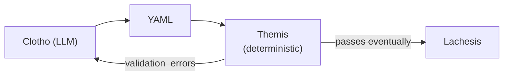
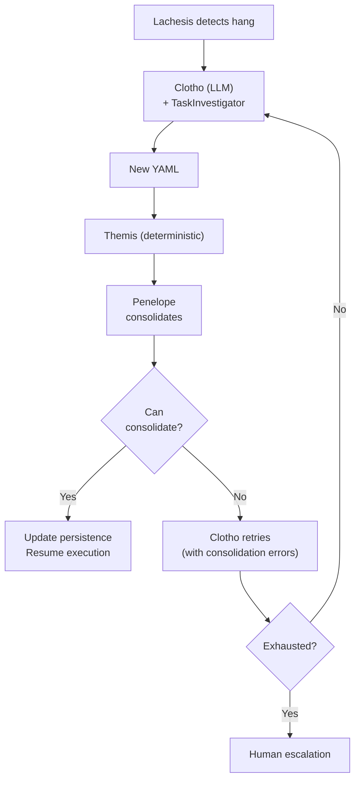
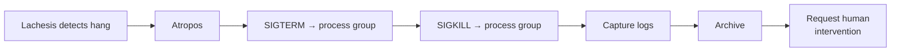
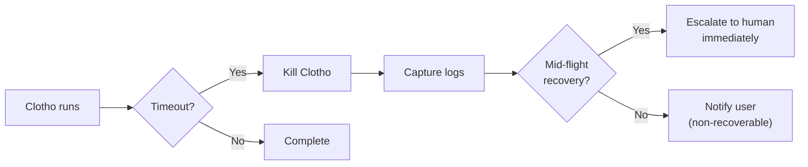
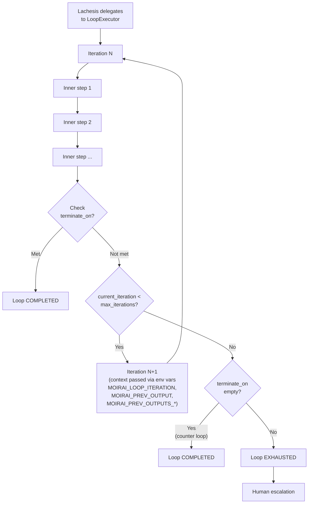
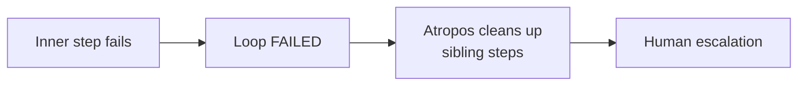

# Moirai — Deterministic Agent Task Graph Scheduler

## 1. Overview

Moirai is a deterministic **agent task graph scheduler** built in Python with PyYAML for YAML parsing and the standard library for everything else. It orchestrates multi-step agent workflows by accepting a high-level user prompt and driving it through a pipeline of components — from natural-language intent to a validated state machine to deterministic task execution.

The system is named after the **Moirai** (the three Fates of Greek mythology) and related figures, reflecting each component's role in weaving, measuring, and cutting the threads of a workflow.

At a high level, Moirai:

1. Accepts a user's natural-language prompt describing a desired workflow.
2. Uses an LLM-powered component (**Clotho**) to generate a YAML workflow artifact.
3. Validates the YAML via a deterministic component (**Themis**) which performs both semantic and structural validation. GraphValidator is folded into Themis as an internal class for DAG acyclicity checks and topological sort.
4. Executes the state machine deterministically via a scheduler (**Lachesis**).
5. Handles mid-flight changes, task failures, and timeouts through dedicated consolidation (**Penelope**) and cleanup (**Atropos**) components.

**Key design principles:**
- **Deterministic execution** — only Clotho (LLM-powered YAML generation) is non-deterministic. Themis, GraphValidator, Lachesis, Penelope, and Atropos are all deterministic coded components. Non-determinism is isolated exclusively to Clotho.
- **PyYAML for parsing** — uses the established PyYAML library for robust YAML parsing and emission, with the standard library for everything else.
- **Error recovery via retry loops** — validation failures, hanging tasks, and problematic YAML changes trigger structured retry loops with escalation to human intervention when limits are exceeded.
- **Testability by design** — all component boundaries are defined as Python Protocol interfaces, enabling test doubles (fakes/mocks) for isolated unit testing.

---

## 2. Module / Package Structure

```
moirai/
├── pyproject.toml            # Project metadata, dependency management (uv)
├── README.md                 # Project overview and setup
├── CONTRIBUTING.md           # Contribution guidelines
├── moirai/
│   ├── __init__.py           # Pipeline wiring, entry point
│   ├── __main__.py           # CLI entry point: python -m moirai (argparse-based CLI, see §7.8)
│   ├── cli.py                # CLI command handlers (run, create template, list, status, cancel, review, update)
│   ├── config.py             # Config dataclass, env/file loading, validation
│   ├── types.py              # All shared data structures (dataclasses, TypedDicts)
│   ├── protocols.py          # All interface protocols (LLMClient, PersistenceBackend, etc.)
│   ├── clotho.py             # Clotho — LLM-powered YAML generation (only LLM component)
│   ├── themis.py             # Themis — deterministic YAML validation + state machine generation (contains GraphValidator as internal class)
│   ├── graph_validator.py    # (Deprecated in v5 — folded into themis.py as Themis._graph_validator)
│   ├── templates.py          # Template loading, parameter substitution, validation (see §7.7)
│   ├── lachesis.py           # Lachesis — deterministic scheduler
│   ├── loop_executor.py      # LoopExecutor — standalone loop iteration manager
│   ├── penelope.py           # Penelope — deterministic consolidation
│   ├── atropos.py            # Atropos — cleanup / process termination
│   ├── persistence/
│   │   ├── __init__.py       # PersistenceBackend protocol + factory
│   │   ├── file_backend.py   # File-based backend (atomic rename)
│   │   └── memory_backend.py # In-memory backend (testing, single-run)
│   ├── agents/
│   │   ├── __init__.py       # Agent registry loading
│   │   └── registry.py       # AgentDef dataclass, config file loading
│   ├── human_intervention.py # Human decision polling, timeout, fallback
│   ├── logging_utils.py      # Structured JSON logging
├── metrics.py             # Internal counters/gauges
└── audit.py               # Append-only audit log
```

---

## 3. Core Data Structures

All shared types live in `types.py` as Python dataclasses. These are the contracts between every component.

```python
from dataclasses import dataclass, field
from typing import Optional, Literal
from enum import Enum, auto


# ─── Enums ──────────────────────────────────────────────────────────

class TaskStatus(Enum):
    PENDING    = auto()
    READY      = auto()
    RUNNING    = auto()
    COMPLETED  = auto()
    FAILED     = auto()
    CANCELLED  = auto()
    SKIPPED    = auto()

class HumanDecision(Enum):
    RETRY    = auto()   # Re-attempt the failed/hanging task
    SKIP     = auto()   # Mark task as skipped, continue workflow
    ABORT    = auto()   # Abort the entire workflow
    RESTART  = auto()   # Restart the workflow from scratch
    CONTINUE = auto()   # (v4) Accept current loop output as meeting terminate_on condition

class FailureReason(Enum):
    TIMEOUT_EXCEEDED = auto()
    CRASH_LIMIT_EXCEEDED = auto()
    CONSOLIDATION_FAILURE = auto()
    CLOTHO_TIMEOUT = auto()
    USER_ABORT = auto()
    LOOP_EXHAUSTED = auto()  # Loop step hit max_iterations without termination

class LoopStatus(Enum):
    """Status of a loop step's internal execution."""
    ITERATING = auto()       # Running inner steps
    COMPLETED = auto()       # terminate_on condition met (or max_iterations reached with no terminate_on set)
    EXHAUSTED = auto()       # max_iterations reached without termination (only when terminate_on is set and unmet)
    PENDING   = auto()       # Not yet started
    CANCELLED = auto()

class CleanupOutcome(Enum):
    KILLED          = auto()   # SIGTERM succeeded
    FORCE_KILLED    = auto()   # SIGTERM failed, SIGKILL succeeded
    ALREADY_DEAD    = auto()   # Process was already gone
    FAILED          = auto()   # Could not terminate (permission, zombie)
    SKIPPED         = auto()   # No process to clean up

class PersistenceBackendType(Enum):
    FILE   = auto()
    MEMORY = auto()
    SQLITE = auto()


# ─── Core Data Types ────────────────────────────────────────────────

@dataclass
class AgentDef:
    """Definition of an agent that can execute tasks."""
    id: str                              # Unique agent identifier
    name: str                            # Human-readable name
    command: str                         # Path to executable or command template
    env_vars: dict[str, str] = field(default_factory=dict)
    work_dir: Optional[str] = None
    max_concurrent_tasks: int = 1
    tags: list[str] = field(default_factory=list)

@dataclass
class TaskDef:
    """A task definition within a workflow YAML artifact."""
    id: str                              # Stable task identifier (across YAML versions)
    type: str = "agent"                  # (v5) Task type: "agent" (runs via LLM agent like Hermes) or "script" (direct shell command, no AI agent needed)
    agent: str                           # References AgentDef.id
    command: str                         # Shell command to execute
    deps: list[str] = field(default_factory=list)  # Task IDs this task depends on
    timeout: int = 3600                  # Seconds before deemed hanging
    max_retries: int = 3                 # Times to auto-retry on crash
    env: dict[str, str] = field(default_factory=dict)
    inputs: dict[str, str] = field(default_factory=dict)
    outputs: list[str] = field(default_factory=list)

@dataclass
class LoopDef:
    """A loop step definition within a workflow YAML artifact.

    A loop step is a node in the outer DAG that internally contains a
    sub-graph of steps executed in a bounded iteration loop.
    """
    id: str                              # Stable task identifier
    type: Literal["loop"] = "loop"       # Discriminator from TaskDef
    max_iterations: int = 5              # Maximum number of iterations
    terminate_on: str = ""               # (v4) Condition string checked after each iteration. Empty = counter-controlled loop (runs exactly max_iterations, reports COMPLETED)
    deps: list[str] = field(default_factory=list)  # Outer DAG dependencies (opaque)
    inner_steps: list[TaskDef] = field(default_factory=list)  # Inner step definitions
    loop_timeout: Optional[int] = None   # (v4) Wall-clock timeout for entire loop step in seconds. Default: max_iterations * max(inner_step_timeout) * len(inner_steps)
    max_concurrent_inner: int = 1        # (v4) Max concurrent inner steps within a loop iteration. Default 1 = sequential. Independent from outer pool.

@dataclass
class ValidationError:
    """Structured error from validation (Themis or GraphValidator)."""
    field: str                           # Dot-separated field path, e.g. "tasks.build.command"
    message: str                         # Human-readable explanation
    severity: Literal["error", "warning"] = "error"
    yaml_line: Optional[int] = None      # Line number in the original YAML (if available)
    error_code: str = "UNKNOWN"          # Machine-readable error code
    task_id: Optional[str] = None        # Which task the error relates to

@dataclass
class StateMachine:
    """Formal representation of a workflow as a DAG of tasks.

    Themis produces this; Lachesis executes it; Penelope diffs it.
    """
    workflow_id: str                     # Unique workflow identifier
    version: int                         # Monotonically increasing per workflow
    tasks: dict[str, TaskDef]            # task_id → TaskDef (regular task node map)
    loop_tasks: dict[str, LoopDef]       # task_id → LoopDef (loop step node map)
    dependencies: dict[str, list[str]]   # task_id → list of dependency task_ids
    entry_points: list[str]              # Tasks with no dependencies (zero in-degree)
    metadata: dict[str, str] = field(default_factory=dict)

@dataclass
class TaskState:
    """Current execution state of a single task."""
    task_id: str
    status: TaskStatus = TaskStatus.PENDING
    attempts: int = 0                    # Number of times this task has been started
    started_at: Optional[float] = None   # Unix timestamp
    completed_at: Optional[float] = None
    exit_code: Optional[int] = None
    stdout_path: Optional[str] = None
    stderr_path: Optional[str] = None
    failure_reason: Optional[FailureReason] = None
    error_message: Optional[str] = None

@dataclass
class LoopTaskState:
    """Execution state for a loop step — tracks inner iteration progress.

    A loop step node in the outer DAG contains an internal sub-graph of steps.
    The outer DAG sees the loop step as a single opaque node; the inner steps
    execute per iteration.
    """
    task_id: str
    status: TaskStatus = TaskStatus.PENDING
    loop_status: LoopStatus = LoopStatus.PENDING
    current_iteration: int = 0           # 1-based, resets on PENDING
    max_iterations: int = 5              # Hard limit from step definition
    terminate_on: str = ""               # Condition string (empty = counter-controlled loop)
    last_inner_outputs: dict[str, str] = field(default_factory=dict)  # (v4) step_id → output from last completed iteration (replaces single last_inner_output)
    last_inner_output: Optional[str] = None  # (v4) Deprecated alias — kept for persistence compatibility, derived from last_inner_outputs values
    inner_task_states: dict[str, TaskState] = field(default_factory=dict)
    inner_execution_order: list[str] = field(default_factory=list)  # (v4) Cached topological order computed by Lachesis at first dispatch
    loop_timeout: Optional[int] = None   # (v4) Wall-clock deadline (absolute Unix timestamp) for entire loop
    loop_started_at: Optional[float] = None  # (v4) Unix timestamp when loop first entered ITERATING
    loop_failed_iterations: int = 0      # (v4) Cumulative count of iterations that failed (complements current_iteration)
    iteration_log: list[dict] = field(default_factory=list)  # (v4) Persistent per-iteration record

@dataclass
class ExecutionState:
    """Snapshot of all task states in a workflow at a point in time."""
    workflow_id: str
    tasks: dict[str, TaskState]          # task_id → TaskState (regular tasks)
    loop_tasks: dict[str, LoopTaskState] = field(default_factory=dict)  # task_id → LoopTaskState
    current_sm_version: int

@dataclass
class ConsolidationPlan:
    """Result of comparing old and new state machines during mid-flight change."""
    new_tasks: list[str]                 # Task IDs added in new SM
    removed_tasks: list[str]             # Task IDs absent from new SM
    unchanged_tasks: list[str]           # Task IDs with identical definition
    modified_tasks: dict[str, str]       # task_id → "removed+added" reason
    state_transfers: dict[str, TaskStatus]  # task_id → target status after consolidation
    can_consolidate: bool
    errors: list[ConsolidationError] = field(default_factory=list)

@dataclass
class ConsolidationError:
    reason: str
    task_id: Optional[str] = None
    details: str = ""

@dataclass
class TaskEvent:
    """Event emitted when a task transitions between states."""
    task_id: str
    from_status: TaskStatus
    to_status: TaskStatus
    timestamp: float
    details: Optional[str] = None

@dataclass
class ExecutionLog:
    """Full log of a workflow execution."""
    workflow_id: str
    start_time: float
    end_time: Optional[float] = None
    tasks: dict[str, TaskState] = field(default_factory=dict)
    events: list[TaskEvent] = field(default_factory=list)
    outcome: Optional[str] = None         # "success", "failed", "aborted", "cancelled"

@dataclass
class ProcessInfo:
    """Information about a task's OS process."""
    pid: int
    pgid: int                            # Process group ID (for killpg cleanup)
    start_time: float
    command: str
    stdout_path: str
    stderr_path: str

@dataclass
class CleanupConfig:
    """Configuration for Atropos cleanup behavior."""
    sigterm_grace_seconds: int = 10
    kill_retry_count: int = 3            # Retries on failed SIGKILL
    kill_retry_delay_seconds: float = 1.0
    log_retention_days: int = 30

@dataclass
class CleanupResult:
    outcome: CleanupOutcome
    pid: int
    log_archive_path: Optional[str] = None
    details: str = ""

@dataclass
class LogArchive:
    """Reference to captured logs from a failed/hanging task."""
    workflow_id: str
    task_id: str
    stdout_path: str
    stderr_path: str
    archive_path: str                    # Where logs were collected for investigation
    retained_until: Optional[str] = None  # ISO date of retention expiry

@dataclass
class AuditEntry:
    """Single entry in the append-only audit log."""
    timestamp: float
    event_type: str                      # e.g. "task_completed", "human_escalation", "clotho_timeout"
    workflow_id: str
    task_id: Optional[str] = None
    details: dict = field(default_factory=dict)
```

---

## 4. Protocol Interfaces

All protocol interfaces live in `protocols.py`. These enable test doubles (fakes) for isolated unit testing.

### 4.1 LLMClient Protocol

```python
from typing import Protocol

class LLMClient(Protocol):
    """Interface for LLM calls used by Clotho and Themis.

    Implementations may wrap OpenAI, Anthropic, local models, or be a
    FakeLLMClient for testing.
    """
    def complete(
        self,
        prompt: str,
        system_prompt: str,
        max_tokens: int = 4096,
        temperature: float = 0.7,
        timeout_seconds: int = 120,
    ) -> str:
        """Send a prompt to the LLM and return the text response.

        Raises:
            TimeoutError: If the LLM does not respond within timeout_seconds.
            ConnectionError: If the LLM endpoint is unreachable.
            RateLimitError: If the API rate limit is exceeded.
        """
        ...


class LLMRateLimiter(Protocol):
    """Rate limiter for LLM calls to prevent exceeding API quotas."""
    def acquire(self) -> None:
        """Block until a request slot is available."""
        ...
    
    def release(self) -> None:
        """Release a request slot."""
        ...


class CircuitBreaker(Protocol):
    """Circuit breaker for LLM API calls — prevents hammering a failing endpoint."""
    def call(self, fn, *args, **kwargs):
        """Execute fn if circuit is closed; raise CircuitOpenError if open."""
        ...
```

### 4.2 PersistenceBackend Protocol

```python
class PersistenceBackend(Protocol):
    """Storage interface for tracking task states.

    Must provide atomic read/write operations. The file backend uses
    atomic rename (os.replace) on POSIX-compliant local filesystems.
    NFS v3 and FAT32/exFAT do NOT guarantee atomic rename — operators
    should use SQLite backend or a POSIX-local filesystem.
    """

    def get_task(self, workflow_id: str, task_id: str) -> Optional[TaskState]: ...
    def set_task(self, workflow_id: str, task_id: str, state: TaskState) -> None: ...
    def list_tasks(self, workflow_id: str) -> list[TaskState]: ...
    
    def get_execution_state(self, workflow_id: str) -> Optional[ExecutionState]: ...
    def set_execution_state(self, state: ExecutionState) -> None: ...
    
    def atomic_transaction(self) -> ContextManager:
        """Context manager providing atomic all-or-nothing writes.
        
        If an exception occurs inside the context, all writes are discarded.
        On success exit, all writes are committed atomically.
        """
        ...

    def health_check(self) -> bool:
        """Verify the backend is operational (can read/write)."""
        ...

    def get_schema_version(self) -> int: ...
    def set_schema_version(self, version: int) -> None: ...
```

### 4.3 ProcessManager Protocol

```python
class ProcessManager(Protocol):
    """Abstraction over OS process management for testability."""

    def spawn(self, task_def: TaskDef, agent_def: AgentDef,
              work_dir: str, log_dir: str) -> ProcessInfo:
        """Spawn a task as a child process with process-group isolation.
        
        The child is placed in a new process group (os.setpgid) so that
        Atropos can kill the entire process tree via os.killpg.
        """
        ...

    def poll(self, process: ProcessInfo) -> Optional[int]:
        """Check if process has exited. Returns exit code or None."""
        ...

    def wait(self, process: ProcessInfo, timeout: float) -> int:
        """Wait for process to exit. Returns exit code. Raises TimeoutError."""
        ...

    def signal(self, process: ProcessInfo, sig: int) -> None:
        """Send a signal to the process group (os.killpg)."""
        ...

    def read_output(self, process: ProcessInfo) -> tuple[str, str]:
        """Read captured stdout/stderr from log files."""
        ...
```

### 4.4 HumanNotifier Protocol

```python
class HumanNotifier(Protocol):
    """Interface for requesting and polling human decisions."""

    def request_intervention(
        self,
        workflow_id: str,
        task_id: Optional[str],
        reason: str,
        logs: Optional[str] = None,
    ) -> str:
        """Raise a human intervention request.
        
        Returns a request ID that can be used to poll for the decision.
        The notification mechanism is implementation-defined (file signal,
        stdout message, HTTP callback, email).
        """
        ...

    def poll_decision(
        self,
        request_id: str,
        timeout_seconds: float = 86400.0,  # Default 24h
    ) -> Optional[HumanDecision]:
        """Poll for a human decision.
        
        Returns None if no decision has been made yet.
        Raises TimeoutError if the timeout expires without a decision
        (the default fallback is HumanDecision.ABORT).
        """
        ...

    def cancel_request(self, request_id: str) -> None: ...
```

### 4.5 Clock / TimeProvider Protocol

```python
class TimeProvider(Protocol):
    """Abstract time source for testing time-dependent behavior."""

    def now(self) -> float:
        """Current time in Unix seconds."""
        ...

    def sleep(self, seconds: float) -> None:
        """Block for the given duration (or advance fake time in tests)."""
        ...
```

### 4.6 TaskInvestigator Protocol

```python
class TaskInvestigator(Protocol):
    """Bounded context for Clotho to investigate a hanging task.
    
    Clotho does NOT have unbounded system access — it can only use
    the methods below to gather information.
    """
    def read_logs(self, task_id: str, max_lines: int = 200) -> str: ...
    def get_task_state(self, task_id: str) -> Optional[TaskState]: ...
    def list_workflow_tasks(self) -> list[TaskState]: ...
    def get_workflow_context(self) -> dict: ...
```

### 4.7 LoopExecutor Protocol (v4)

```python
class LoopExecutor(Protocol):
    """Standalone loop iteration manager — extracted from Lachesis for testability.

    LoopExecutor handles the inner iteration lifecycle of a loop step.
    It receives loop state and process-management infrastructure, and
    returns iteration outcomes. Lachesis delegates loop step management
    to this component rather than embedding it inline.
    """

    def execute_iteration(
        self,
        loop_state: LoopTaskState,
        loop_def: LoopDef,
        process_manager: ProcessManager,
        time_provider: TimeProvider,
    ) -> LoopIterationResult:
        """Execute one iteration of inner steps.

        Spawns inner steps, polls for completion, handles inner step
        failures, checks terminate_on, and returns the iteration result.
        Inner step hang detection is handled here, not in Lachesis's
        main polling loop.
        """
        ...

    def check_terminate_on(
        self,
        output: str,
        condition: str,
    ) -> bool:
        """Pure function: does 'output' match 'condition'?

        Uses whole-word matching (\\bCONDITION\\b) rather than bare
        substring matching to prevent false positives.
        Extracted as a pure, independently testable function.
        """
        ...

    def build_iteration_context(
        self,
        previous_outputs: dict[str, str],
        current_iteration: int,
    ) -> dict[str, str]:
        """Build context dict for the next iteration from previous outputs.

        Returns a dict of environment variable overrides:
        - MOIRAI_LOOP_ITERATION=N
        - MOIRAI_PREV_OUTPUT=<final step output>
        - MOIRAI_PREV_OUTPUTS_<step_id>=<output> for each step
        """
        ...


@dataclass
class LoopIterationResult:
    """Outcome of a single loop iteration."""
    completed: bool                       # True if all inner steps completed (regardless of terminate_on)
    terminate_on_met: bool                # True if terminate_on condition matched
    inner_outputs: dict[str, str]         # step_id → captured stdout
    final_output: str                     # Concatenated output of leaf node(s)
    failed_steps: list[str]               # Inner step IDs that failed
    failure_reason: Optional[FailureReason] = None
```

---

## 5. YAML Workflow Schema

The YAML artifact is a string emitted by Clotho and consumed by Themis. YAML is:
- **Emitted** as a raw string by Clotho (using string formatting/templates or PyYAML's `yaml.dump()`)
- **Parsed** by Themis using PyYAML's `yaml.safe_load()` into Python dicts for validation
- **Validated** structurally by Themis's internal GraphValidator

### Schema

```yaml
# Minimal example: data pipeline
workflow:
  id: "data-pipeline-001"
  name: "Data Processing Pipeline"
  version: 1
  
  agents:
    - id: "etl-agent"
      name: "ETL Worker"
      command: "/usr/local/bin/etl-worker"
    
    - id: "ml-agent"
      name: "ML Trainer"
      command: "/usr/local/bin/ml-train"
  
  tasks:
    - id: "extract"
      agent: "etl-agent"
      command: "./scripts/extract.sh --source {{ .inputs.source }}"
      deps: []
      timeout: 300
      max_retries: 2
      inputs:
        source: "s3://data/raw"
    
    - id: "transform"
      agent: "etl-agent"
      command: "./scripts/transform.sh"
      deps: ["extract"]
      timeout: 600
      max_retries: 3
    
    - id: "load"
      agent: "etl-agent"
      command: "./scripts/load.sh"
      deps: ["transform"]
      timeout: 300
      max_retries: 2
    
    - id: "train"
      agent: "ml-agent"
      command: "./scripts/train.py --data-dir {{ .inputs.data_dir }}"
      deps: ["load"]
      timeout: 3600
      max_retries: 1
      inputs:
        data_dir: "/tmp/transformed"

    # Loop step example: dev -> review -> fix -> review until approved
    - id: "feature-work"
      type: loop
      max_iterations: 5
      terminate_on: "APPROVED"
      deps: []
      steps:
        - id: "implement"
          agent: "etl-agent"
          command: "./scripts/implement.sh"
          deps: []
        - id: "review"
          agent: "ml-agent"
          command: "./scripts/code-review.sh"
          deps: ["implement"]
```

### Schema Rules

| Field | Parent | Required | Type | Description |
|-------|--------|----------|------|-------------|
| `workflow` | root | yes | dict | Root element |
| `workflow.id` | workflow | yes | string | Unique workflow identifier |
| `workflow.name` | workflow | yes | string | Human-readable name |
| `workflow.version` | workflow | yes | int | Monotonically increasing |
| `workflow.agents[]` | workflow | yes | list | Agent definitions |
| `workflow.agents[].id` | agent | yes | string | Unique agent ID (referenced by tasks) |
| `workflow.agents[].name` | agent | yes | string | Human-readable agent name |
| `workflow.agents[].command` | agent | yes | string | Executable path or command template |
| `workflow.tasks[]` | workflow | yes | list | Task definitions |
| `workflow.tasks[].id` | task | yes | string | Stable task identifier |
| `workflow.tasks[].type` | task | no (default: `"agent"`) | string | (v5) Task type: `"agent"` (LLM agent tasks like Hermes) or `"script"` (direct shell commands) |
| `workflow.tasks[].agent` | task | yes | string | References an agent ID |
| `workflow.tasks[].command` | task | yes | string | Shell command to execute |
| `workflow.tasks[].deps` | task | yes | list of strings | Task IDs this task depends on (unified field name — used for both outer and inner steps) |
| `workflow.tasks[].timeout` | task | no (default: 3600) | int | Max seconds before deemed hanging |
| `workflow.tasks[].max_retries` | task | no (default: 3) | int | Auto-retry count on crash |
| `workflow.tasks[].inputs` | task | no | dict | Key-value input parameters |

**Loop step fields** (when `workflow.tasks[].type` is `"loop"`):

| Field | Parent | Required | Type | Description |
|-------|--------|----------|------|-------------|
| `workflow.tasks[].type` | task | no (default: `"task"`) | string | Step type: `"task"` for regular steps, `"loop"` for loop steps |
| `workflow.tasks[].max_iterations` | loop task | no (default: 5) | int | Maximum number of iterations before exhaustion |
| `workflow.tasks[].terminate_on` | loop task | no (default: `""`) | string | (v4) String to check in the leaf inner step(s) output. Empty string = counter-controlled loop (runs exactly max_iterations, reports COMPLETED). Non-empty = whole-word matching (`\bcondition\b`) against leaf step outputs. |
| `workflow.tasks[].loop_timeout` | loop task | no | int | (v4) Wall-clock timeout for entire loop step in seconds. Default: computed as max_iterations * max(inner_step_timeout) * len(inner_steps) |
| `workflow.tasks[].max_concurrent_inner` | loop task | no (default: 1) | int | (v4) Max concurrent inner steps within a single iteration. Default 1 = sequential. Independent from outer scheduler pool. |
| `workflow.tasks[].steps` | loop task | yes | list | Inner step definitions (same schema as outer `tasks[]`, with `deps` scoped within the loop) |
| `workflow.tasks[].steps[].id` | inner step | yes | string | Inner step identifier (scoped to the loop) |
| `workflow.tasks[].steps[].agent` | inner step | yes | string | References an agent ID |
| `workflow.tasks[].steps[].command` | inner step | yes | string | Shell command to execute |
| `workflow.tasks[].steps[].deps` | inner step | yes | list of strings | (v4) Unified field name `deps` (was `depends_on`). Inner step IDs this step depends on (scoped within the loop) |
| `workflow.tasks[].steps[].timeout` | inner step | no (default: 3600) | int | Max seconds before deemed hanging |
| `workflow.tasks[].steps[].max_retries` | inner step | no (default: 3) | int | Auto-retry count on crash |
| `workflow.tasks[].steps[].inputs` | inner step | no | dict | Key-value input parameters |

**Note (v4):** The inner step `deps` field was renamed from `depends_on` (v3) to `deps` for consistency with outer tasks. The YAML parser accepts both `deps` and `depends_on` for backward compatibility with v3 workflows, mapping them to the same `TaskDef.deps` field.

---

## 6. GraphValidator — Deterministic Structural Validation (Internal to Themis)

**New component** — GraphValidator is now an internal class within Themis (folded in per user design preference). While Themis handles combined semantic + structural validation deterministically, **GraphValidator** is the internal class/method that handles all deterministic DAG checks.

**Role:** Validates that a parsed workflow YAML forms a valid DAG with well-formed transitions. Runs within Themis during validation, *after* basic YAML parsing and *before* the StateMachine is output.

**Nature:** Fully deterministic. Simple graph algorithms — no LLM involvement.

**Inputs:**
| Input | Type | Description |
|-------|------|-------------|
| `tasks` | `dict[str, TaskDef]` | Parsed regular task definitions |
| `loop_tasks` | `dict[str, LoopDef]` | Parsed loop step definitions |
| `dependencies` | `dict[str, list[str]]` | Dependency adjacency lists (outer DAG only) |

**Outputs:**
| Output | Type | Description |
|--------|------|-------------|
| `state_machine` | `Optional[StateMachine]` | Validated state machine (if all checks pass) |
| `errors` | `list[ValidationError]` | Structural errors found |
| `is_valid` | `bool` | Whether the graph passed all checks |

**Validation checks:**
1. **Acyclicity** — DFS-based cycle detection (back-edge check). Guarantees the dependency graph is a DAG. Loop steps are treated as **single opaque nodes** — their inner sub-graphs are NOT traversed during outer cycle detection.
2. **All task references valid** — every `deps` entry references an existing task ID (across both regular and loop tasks).
3. **Agent references valid** — every task's `agent` field references an existing agent ID. This applies to both regular tasks AND loop inner steps (which are `TaskDef` objects and must reference valid agents).
4. **No orphan tasks** — every task is reachable from at least one entry point (transitive closure).
5. **Single root** — there is at least one task with zero dependencies (entry point).
6. **Topological ordering** — tasks can be topologically sorted (produce execution order).
7. **Well-formed transitions** — no self-loops, no duplicate dependency entries.
8. **Loop step inner validation** — for each loop step:
   - Inner `deps` references must be scoped within that loop's inner steps only (no cross-boundary references).
   - Inner steps must form a connected sub-graph reachable from at least one inner entry point.
   - At least one inner step must be defined (non-empty `steps`).
   - `max_iterations` must be positive (>= 1).
   - `terminate_on` may be empty (v4: counter-controlled loop). If non-empty, it should be a meaningful string.
9. **No cross-boundary dependencies** — no outer task may depend on an inner step ID, and no inner step may depend on an outer task ID.

**Loop opaqueness invariants (v4 — explicit test fixtures):**
- An outer cycle *through* a loop step (outer A → loop L → outer B, where outer B depends on outer A) IS detected by outer cycle detection.
- An inner cycle (inner step X → inner step Y → inner step X) does NOT cause an outer acyclicity failure.
- Cross-boundary dependency references (outer task depending on inner step ID, inner step depending on outer task ID) are caught and rejected.
- These invariants are tested via table-driven GraphValidator test fixtures (see §19.1).

**Assumptions:**
- The YAML has already been structurally parsed (via PyYAML → Python dicts) before reaching GraphValidator.
- Themis has already verified basic correctness (agent names match real agents, commands exist, YAML is well-formed).
- GraphValidator is called as a method on Themis — it outputs a `StateMachine` with `entry_points`, `dependencies`, and a topologically sorted task order.
- Loop steps are opaque to the outer DAG — GraphValidator does NOT analyze the internal structure of loops for cycle detection in the outer graph.

---

## 7. Updated Component Breakdown

### 7.1 Clotho — YAML Generation (LLM, Non-deterministic)

**Role:** Entry point into the system. Clotho takes a user's natural-language prompt and generates a valid YAML workflow artifact.

**Nature:** LLM-powered, non-deterministic. The same prompt may produce different YAML outputs across invocations.

**Inputs:**
| Input | Type | Description |
|-------|------|-------------|
| `user_prompt` | `str` | Natural-language description of the desired workflow |
| `previous_yaml` (optional) | `str` | Previously generated YAML from a prior Clotho attempt (provided during retry loops) |
| `validation_errors` (optional) | `list[ValidationError]` | Structured errors from Themis or GraphValidator when re-attempting after a validation failure |
| `hanging_task_info` (optional) | `HangingTaskInfo` | Task ID, failure reason, and a bounded `TaskInvestigator` context for investigation |
| `max_retries` | `int` | Maximum number of consecutive Clotho → Themis cycles before escalation |
| `investigator` (optional) | `TaskInvestigator` | Bounded investigation context for mid-flight hang recovery |

**Outputs:**
| Output | Type | Description |
|--------|------|-------------|
| `yaml_artifact` | `str` | A YAML string describing tasks, their properties, dependencies, and assigned agents |
| `escalation_needed` | `bool` | Flag indicating Clotho needs more information from the user (human intervention) |
| `escalation_message` | `str` | Free-text message to the user explaining what additional information is required |

**Assumptions:**
- Clotho has access to a configured `LLMClient` (via dependency injection — not hardcoded) with a configurable base CLI command. The provider backend is configured via `clotho_provider` and `clotho_base_command` (default: `hermes --profile Clotho`), allowing future swaps to Claude Code, OpenAI API, or other providers.
- Clotho understands the YAML schema for workflow artifacts (defined in §5). It generates `type: "agent"` or `type: "script"` tasks as appropriate based on the prompt and task nature.
- Clotho can escalate to the user when the prompt is ambiguous or incomplete.
- The YAML output is syntactically valid YAML, but *not* guaranteed to be semantically valid — that is Themis's job.
- Clotho has a configurable timeout; if exceeded, Clotho is killed and the user is notified.
- Clotho uses the `LLMClient` protocol with exponential backoff on transient errors.

**Behavior in failure loops:**
- Given previous YAML + validation errors, Clotho should attempt to fix the specific issues rather than regenerate from scratch.
- Given `hanging_task_info` + bounded `TaskInvestigator`, Clotho may read logs and inspect task state but has no unbounded system access.
- Clotho should attempt to produce a *different* YAML than the previous attempt (avoiding no-op retries). Themis/GraphValidator can detect identical re-submissions and reject them.
- Retries use exponential backoff (base delay 1s, multiplier 2x, max 30s) with jitter.

**HangingTaskInfo structure:**
```python
@dataclass
class HangingTaskInfo:
    task_id: str
    failure_reason: FailureReason
    previous_yaml: str
    current_execution_state: ExecutionState
```

---

### 7.2 Themis — YAML Validator & State Machine Generator (Deterministic)

**Role:** Themis validates the YAML workflow artifact produced by Clotho and produces a validated `StateMachine`. It performs all YAML parsing (via PyYAML), structural validation (including DAG acyclicity checks via its internal GraphValidator), and semantic validation (checking agent references, command validity, input parameter consistency). Themis is the sole deterministic validator — no LLM involvement.

**Nature:** Fully deterministic. Pure logic — no LLM involvement.

> **Note:** The existing Hermes profile named `themis` will need renaming to avoid a naming conflict with this component.

**Inputs:**
| Input | Type | Description |
|-------|------|-------------|
| `yaml_artifact` | `str` | The YAML workflow string to validate and process |
| `known_agents` | `list[AgentDef]` | List of agents from the agent registry, for cross-referencing |

**Outputs:**
| Output | Type | Description |
|--------|------|-------------|
| `state_machine` | `Optional[StateMachine]` | Validated state machine (if all checks pass) |
| `validation_errors` | `list[ValidationError]` | Structured error list describing issues found |
| `is_valid` | `bool` | Whether the YAML passed all validation |

**Themis handles:**
1. **YAML parsing** — parses the YAML string via `yaml.safe_load()` into Python dicts.
2. **Schema validation** — checks required fields exist, field types are correct, structure matches the schema defined in §5.
3. **Agent cross-referencing** — verifies every task's `agent` field references an existing agent ID from the agent registry. This applies to both regular tasks and loop inner steps.
4. **Command validation** — checks that referenced commands are plausible and exist (basic path checking).
5. **Input parameter validation** — checks that `{{ .inputs.xxx }}` references match valid input keys.
6. **DAG structural validation** — delegates to internal GraphValidator for: acyclicity (DFS-based cycle detection), topological ordering, dependency integrity, entry-point detection, orphan-task detection, self-loop detection, loop step inner validation (inner dependency scoping, connectivity, non-empty steps, positive max_iterations), cross-boundary dependency rejection.
7. **Loop opaqueness verification** — ensures outer cycle through a loop step is detected, inner cycle does NOT cause outer acyclicity failure, cross-boundary references are rejected.

**Themis does NOT handle:**
- Natural-language understanding of the prompt — that is Clotho's job.
- LLM-based semantic analysis — all validation is deterministic.

**Pipeline position:**
```
User Prompt → Clotho (LLM) → YAML → Themis (deterministic: parse + validate + GraphValidator) → StateMachine → Lachesis
```

**Assumptions:**
- The YAML schema is documented (§5) and stable across versions.
- The agent registry is loaded and available at validation time.
- Validation errors use the `ValidationError` structure defined in §3.
- GraphValidator is an internal class (`Themis._graph_validator`) that Themis calls during validation.

---

### 7.3 GraphValidator — Internal Class within Themis

GraphValidator is now an internal class/method within the Themis component (folded in per user design preference). See §6 for the full definition.

**Pipeline position:**
```
User Prompt → Clotho (LLM) → YAML → Themis (deterministic: parse → schema validate → GraphValidator structural checks → StateMachine) → Lachesis
```

The old standalone pipeline (Clotho → Themis → GraphValidator) is replaced by a single Themis pass that internally calls GraphValidator for DAG structural checks.

---

### 7.4 Lachesis — Deterministic Scheduler (Deterministic)

**Role:** Lachesis is the core scheduling engine. It takes a validated state machine from GraphValidator and executes the workflow deterministically. It polls tasks, updates progress on the persistence layer, and kicks off the next task when all its dependencies have been met.

**Nature:** Fully deterministic. No LLM involvement. Pure logic.

**Inputs:**
| Input | Type | Description |
|-------|------|-------------|
| `state_machine` | `StateMachine` | The validated state machine from GraphValidator |
| `persistence` | `PersistenceBackend` | Storage interface for tracking task states |
| `process_manager` | `ProcessManager` | Interface for spawning and managing task processes |
| `human_notifier` | `HumanNotifier` | Interface for human escalation |
| `time_provider` | `TimeProvider` | Abstract time source |
| `config` | `SchedulerConfig` | Scheduler configuration |

**SchedulerConfig:**
```python
@dataclass
class SchedulerConfig:
    max_concurrent_tasks: int = 4       # Max tasks running simultaneously
    poll_interval_seconds: float = 1.0  # How often to check for ready tasks
    hang_check_interval_seconds: float = 5.0  # How often to check for hanging tasks
    crash_recovery_enabled: bool = True
    graceful_shutdown_timeout: float = 30.0
```

**Outputs:**
| Output | Type | Description |
|--------|------|-------------|
| `task_status_updates` | `list[TaskEvent]` | Events emitted when tasks transition between states |
| `execution_log` | `ExecutionLog` | Full log of all task executions, durations, and outcomes |

**Responsibilities:**
- Maintain a queue of ready tasks (all deps satisfied, not yet started).
- Enforce `max_concurrent_tasks` — do not exceed the configured parallelism limit.
- Use `ProcessManager.spawn()` to dispatch tasks as subprocesses with process-group isolation.
- Use `ProcessManager.poll()` for non-blocking completion checks (polling model — no blocking waitpid).
- Track crash counts in persistence per task.
- Run a periodic hang check using `TimeProvider` to detect running tasks that exceed their timeout.
- Detect hanging tasks (crash count exceeds max_retries, or runtime exceeds timeout).
- Trigger Atropos when a task is determined to be hanging.
- Detect mid-flight YAML changes by watching for a new state machine file/signal.
- When a new state machine arrives mid-flight: pause execution atomically, capture `ExecutionState`, call Penelope, apply consolidation plan, resume.
- Persist all state changes durably using `PersistenceBackend.atomic_transaction()`.
- Install a SIGTERM handler for graceful shutdown: stop accepting new tasks, wait for running tasks up to `graceful_shutdown_timeout`, checkpoint execution state, exit cleanly.
- Support workflow cancellation (user-initiated abort via signal or CLI command): mark all pending/ready tasks as CANCELLED, kill running tasks via Atropos, generate final execution log.
- **Execute loop steps** — when a loop step becomes READY, delegate to `LoopExecutor` for iteration management (see LoopExecutor Protocol §4.7 and Loop Step Execution below).

**Polling model:** Lachesis uses a non-blocking event loop:
```
loop:
  for each running task:
    exit_code = process_manager.poll(process_info)
    if exit_code is not None:
      handle_completion(task_id, exit_code)
  
  # Check for newly ready tasks (including loop steps)
  ready = find_ready_tasks(execution_state, state_machine)
  while ready and running_count < max_concurrent_tasks:
    task = ready.pop(0)
    dispatch_task(task)
  
  # Check for hanging tasks
  check_for_hangs(execution_state, time_provider.now())
  
  time_provider.sleep(poll_interval)
```

**Loop Step Execution:**

When Lachesis encounters a loop step (identified by the presence of a `LoopDef` in the state machine), it delegates iteration management to the **LoopExecutor** (§4.7). The lifecycle is:

1. **Initialization:** On first dispatch, Lachesis creates a `LoopTaskState` with `loop_status = PENDING`, `current_iteration = 0`, and `loop_started_at = None`. The outer DAG treats the loop step as a single RUNNING task — it appears as one node in the task queue.

2. **Iteration start (via LoopExecutor):** The executor increments `current_iteration`, sets `loop_status = ITERATING`, and records `loop_started_at` on first iteration. Inner steps are initialized as PENDING based on the inner dependency graph. The first iteration begins with inner steps that have no `deps` (inner entry points).

3. **Inner step dispatch (via LoopExecutor):** Inner steps are dispatched as subprocesses following the same process model as outer tasks (§9). They are tracked in `LoopTaskState.inner_task_states`. Inner step concurrency is governed by `LoopDef.max_concurrent_inner` (default 1 = sequential), which is independent of the global `max_concurrent_tasks` limit — loops do not consume outer scheduler concurrency slots. Completion of inner steps is checked via `ProcessManager.poll()`.

4. **Inner step hang detection (via LoopExecutor):** Inner steps are polled through LoopExecutor, NOT through Lachesis's main polling loop. This avoids double-handling with outer hang detection. If an inner step hangs:
   - Atropos is invoked with the **inner step's scoped task_id** (`{loop_step_id}.{inner_step_id}`) and the inner step's ProcessInfo.
   - All other RUNNING inner steps in the same iteration are passed to Atropos for cleanup.
   - All PENDING inner steps in the same iteration are marked CANCELLED.
   - The loop step is marked FAILED.
   - `loop_failed_iterations` is NOT incremented (the iteration is considered incomplete).

5. **Iteration completion (via LoopExecutor):** When all inner steps in the current iteration complete:
   - Collect outputs of all **leaf steps** (steps with no dependents in the inner graph).
   - If `terminate_on` is non-empty: check if ANY leaf step's output contains the `terminate_on` condition using whole-word matching (`\bcondition\b`).
   - **If terminate_on is met:** Set `loop_status = COMPLETED`, mark the loop step as COMPLETED in the outer DAG. Downstream tasks that depend on this loop step become READY.
   - **If terminate_on is NOT met and current_iteration < max_iterations:** Increment `current_iteration` and re-run all inner steps. Context from the previous iteration is passed via `LoopExecutor.build_iteration_context()` (see §4.7).
   - **If terminate_on is NOT met and current_iteration >= max_iterations:** Set `loop_status = EXHAUSTED`, mark the loop step as FAILED with `failure_reason = LOOP_EXHAUSTED`. Invoke the escalation path.
   - **If terminate_on is empty (counter-controlled loop):** After each iteration, increment `current_iteration`. When `current_iteration >= max_iterations`, set `loop_status = COMPLETED` (not EXHAUSTED). The loop step is marked COMPLETED in the outer DAG.

6. **Context passing between iterations (v4 — resolved):** The `LoopExecutor.build_iteration_context()` method constructs the context for the next iteration:
   - Environment variables set on each inner step:
     - `MOIRAI_LOOP_ITERATION=N` — current iteration number (1-based)
     - `MOIRAI_PREV_OUTPUT=<output>` — concatenated output of all leaf steps from the previous iteration
     - `MOIRAI_PREV_OUTPUTS_<STEP_ID>=<output>` — per-step output from the previous iteration (e.g., `MOIRAI_PREV_OUTPUTS_REVIEW="APPROVED"`)
   - These env vars are injected into each inner step's environment before spawning.
   - `LoopTaskState.last_inner_outputs` (dict[str, str] mapping step_id → captured stdout) is the authoritative source and is persisted across iterations.
   - A structured log event `loop_context_passed` records the iteration number, context keys, and output checksum for observability.

7. **Loop timeout checking (v4):** At the start of each iteration, LoopExecutor checks `loop_timeout` against wall-clock time:
   - `loop_timeout` in `LoopTaskState` is computed as an absolute Unix timestamp deadline on first entry to ITERATING.
   - If `time_provider.now() > loop_timeout`, the loop is marked FAILED with `failure_reason = TIMEOUT_EXCEEDED`.
   - The `loop_timeout` is derived from `LoopDef.loop_timeout` (if set) or computed as `max_iterations * max(inner_step_timeout) * len(inner_steps)`.

8. **Per-iteration logging (v4):** Each iteration appends an entry to `LoopTaskState.iteration_log`:
   ```json
   {
     "iteration": 3,
     "started_at": 1712345678.0,
     "completed_at": 1712345978.0,
     "inner_steps": {
       "implement": {"status": "COMPLETED", "exit_code": 0},
       "review": {"status": "COMPLETED", "exit_code": 0}
     },
     "terminate_on_met": true,
     "final_output_truncated": "APPROVED — ..."
   }
   ```

9. **Escalation on exhaustion:** When `max_iterations` is exhausted without meeting `terminate_on`, Lachesis:
   - Captures the last iteration's inner step outputs (including the leaf step outputs showing the failure to meet the condition).
   - Marks the loop step as FAILED.
   - Invokes human intervention via `HumanNotifier` with the loop step ID, the `terminate_on` condition, the number of iterations attempted, the `iteration_log`, and the captured outputs.
   - If mid-flight recovery is enabled, Clotho may be invoked (with a bounded investigator) to generate a new YAML that modifies the loop step. **Penelope allows `max_iterations` increase for EXHAUSTED loops** (v4: see §7.5 exception). Changes to `terminate_on` or inner step structure for EXHAUSTED loops are NOT allowed via Clotho recovery — those require human intervention.

**Hang detection mechanism:**
- Crash count is tracked in `TaskState.attempts` and persisted.
- Each time a task crashes (non-zero exit code), attempts is incremented. If `attempts > task_def.max_retries`, the task is marked hanging and Atropos is invoked.
- Runtime is tracked by comparing `TaskState.started_at` against `TimeProvider.now()`. If `now - started_at > task_def.timeout`, the task is marked hanging.
- Hang checks run at `hang_check_interval_seconds` intervals (configurable, default 5s).
- Inner step hang detection is handled by LoopExecutor, not Lachesis's main polling loop, to prevent double-handling. LoopExecutor invokes Atropos for the inner step with its scoped task_id.

**Crash recovery:** If Lachesis itself crashes mid-workflow, on restart:
1. Load `ExecutionState` from persistence.
2. Tasks in `RUNNING` state are treated with caution — Atropos is invoked to clean them up (they may still be alive or already dead).
3. Loop tasks in `ITERATING` state are reset to the start of the iteration indicated by `current_iteration`. All inner task state is discarded. The `current_iteration` counter is preserved (not decremented), so iteration N is re-attempted from scratch. `LoopTaskState.last_inner_outputs` (persisted) provides context for the re-started iteration. Loop tasks in `EXHAUSTED` state are preserved as-is.
4. Tasks in `PENDING`/`READY` state are preserved as-is.
5. The state machine is reloaded and execution resumes from the current state.
6. A recovery audit entry is created.

**Assumptions:**
- The persistence layer provides atomic read/write operations for task state.
- Tasks report their status back through process exit code (captured by ProcessManager).
- Lachesis runs as a long-lived process (or is restarted with state recovery as described above).
- The state machine's DAG is traversed based on topological order (entry points first, then tasks whose dependencies are satisfied).
- Loop steps are opaque to the outer DAG — Lachesis sees one node but delegates iteration management to LoopExecutor.

---

### 7.5 Penelope — Consolidation (Deterministic)

**Role:** When a YAML change occurs mid-flight (e.g., Clotho generates a new workflow to handle a hanging task), Penelope compares the old and new state machines to determine what changed and whether the new machine can be consolidated with the current execution state.

**Nature:** Deterministic. Pure logic — no LLM involvement.

**Inputs:**
| Input | Type | Description |
|-------|------|-------------|
| `old_state_machine` | `StateMachine` | The previously validated state machine currently being executed |
| `new_state_machine` | `StateMachine` | The proposed replacement state machine from GraphValidator |
| `current_execution_state` | `ExecutionState` | Snapshot of what tasks have been completed, are running, or are pending |

**Outputs:**
| Output | Type | Description |
|--------|------|-------------|
| `consolidation_plan` | `ConsolidationPlan` | Structured diff: new tasks, removed tasks, unchanged tasks, modified tasks, and state transfers |

**Task identity model:** Task identity is determined by `task_id` (stable across YAML versions).
- **Same task_id + same properties** → Unchanged task. Preserve current state.
- **Same task_id + different properties** → Modified task. See compatibility rules below.
- **task_id in new but not old** → New task. Added as PENDING.
- **task_id in old but not new** → Removed task. See rules below.

**Consolidation rules:**

| Scenario | Rule |
|----------|------|
| **New task** (in new SM only) | Added to persistence as PENDING |
| **Removed task — not yet started** | Safe to remove |
| **Removed task — completed** | **Invalid** — consolidation fails (cannot erase history) |
| **Removed task — running or hanging** | Mark for cancellation via Atropos, then remove from new SM |
| **Unchanged task** | Preserve current state (PENDING → PENDING, RUNNING → RUNNING, etc.) |
| **Modified task — same agent, same command shape** | Compatible — state transfers as: PENDING → PENDING, READY → READY, RUNNING → reset to PENDING (too risky to keep running with new params), COMPLETED → stay COMPLETED if the change is backward-compatible (e.g., new timeout), otherwise fail |
| **Modified task — different agent or different command** | Incompatible — treated as removed (old) + new (new). If the old task was RUNNING, Atropos cancels it first. If COMPLETED, consolidation fails |
| **Loop step changed — inner steps modified** | If PENDING or ITERATING: cancel all running inner steps via Atropos, reset to PENDING, re-validate inner steps via GraphValidator. If COMPLETED: fail — cannot change a loop whose execution has finished. **If EXHAUSTED: max_iterations increase ONLY is allowed** (v4 exception — see below). All other changes to EXHAUSTED loops fail. |
| **Loop step changed — terminate_on modified** | If PENDING or ITERATING: compatible (condition changes take effect next iteration). Loop is NOT reset to PENDING — the current iteration continues with the new condition. If COMPLETED or EXHAUSTED: fail (unless EXHAUSTED with only max_iterations increase, see above). |
| **Loop step changed — max_iterations increased only** | If EXHAUSTED: **Allowed** (v4 exception). The loop is reset to ITERATING with current_iteration preserved. Termination condition and inner step definitions must be identical. This enables the Clotho-recovery path for exhausted loops. If PENDING or ITERATING: compatible (cap is raised or kept). |
| **New loop step** | Added as PENDING with LoopTaskState |
| **Task converted to/from loop step** | Treated as removed + new — old state must not be COMPLETED or RUNNING |

**Atomicity / Rollback:** Penelope operates as a two-phase process:
1. **Validation phase** — Compute the entire `ConsolidationPlan` in memory. Check all rules. If any rule fails (e.g., completed task removed), return `can_consolidate=False` with errors. No persistence changes are made during this phase.
2. **Application phase** — Only enters if `can_consolidate=True`. All persistence changes are applied within a single `PersistenceBackend.atomic_transaction()`. If anything fails mid-application, the transaction is rolled back and the system remains in the pre-consolidation state.

**Assumptions:**
- Task identity is determined by a stable `task_id` field that persists across YAML versions.
- The state machine includes version metadata.
- The execution state is captured atomically before Penelope runs (Lachesis pauses execution, takes a snapshot, then calls Penelope).
- Penelope is a pure function with no side effects.

---

### 7.6 Atropos — Cleanup (Deterministic)

**Role:** When a task is determined to be hanging (crashed N times, exceeded timeout), Atropos is invoked to cleanly kill the entire process tree, record logs for investigation, and request human intervention.

**Nature:** Deterministic. Process management.

**Inputs:**
| Input | Type | Description |
|-------|------|-------------|
| `task_id` | `str` | The identifier of the hanging task (for inner step hangs, this is the scoped ID `{loop_id}.{inner_step_id}`) |
| `task_process_info` | `ProcessInfo` | Process handle, PID, PGID, start time, stdout/stderr paths |
| `failure_reason` | `FailureReason` | Why the task was deemed hanging |
| `config` | `CleanupConfig` | Timeout for kill signals, log retention policy, retry settings |
| `process_manager` | `ProcessManager` | Interface for process signaling and log capture |
| `human_notifier` | `HumanNotifier` | Interface for escalating to a human |

**Outputs:**
| Output | Type | Description |
|--------|------|-------------|
| `cleanup_result` | `CleanupResult` | Outcome of cleanup (killed, force-killed, already dead, failed) |
| `log_archive` | `LogArchive` | Path to collected logs for investigation |
| `human_intervention_requested` | `bool` | Whether human action is required after Atropos runs |

**Behavior:**
1. Send `SIGTERM` to the **process group** (using `os.killpg(pgid, signal.SIGTERM)`), not just the parent PID — this kills child/grandchild processes too.
2. Wait for configurable grace period (`sigterm_grace_seconds`).
3. If process group still alive, send `SIGKILL` to the process group.
4. If `SIGKILL` fails (permission denied, zombie), retry up to `kill_retry_count` times with `kill_retry_delay_seconds` delay between attempts.
5. If all retries fail, log a warning and set outcome to FAILED.
6. Capture stdout/stderr from the task's log files (paths from `ProcessInfo`).
7. Log and archive the output for investigation (archive path is a timestamped subdirectory under `{log_dir}/{workflow_id}/{task_id}/`).
8. Mark the task as `failed` in persistence with failure reason.
9. Record a detailed failure report in the audit log.
10. Raise a human intervention request via `HumanNotifier.request_intervention()`.

**Assumptions:**
- The task is running as a child process in a process group that the scheduler can signal.
- Tasks are spawned with `os.setpgid()` to place them in their own process group.
- Logs are written to a known location (convention: `{log_dir}/{workflow_id}/{task_id}/{timestamp}.stdout` and `.stderr`).
- Human intervention means a person picks up the failure report and decides how to proceed (retry, skip, abort, continue) — polled via `HumanNotifier.poll_decision()`.
- Atropos does NOT attempt to fix the task — it only cleans up and escalates.
- Atropos has a retry loop for cleanup failures (up to `kill_retry_count` retries on failed kill), after which it logs a warning and still escalates.

---

### 7.7 Template Workflows (v5)

**Role:** Template workflows provide a mechanism for standard development workflows to be saved and reused without Clotho regenerating YAML from scratch each time. Templates contain parameterized placeholders for user prompts and project-specific values.

**Nature:** Deterministic. Template files are YAML documents with placeholder substitution.

**Template YAML format:**

```yaml
# ~/.moirai/templates/dev-workflow.yaml
name: "dev-workflow"
description: "Standard development workflow: implement, review, fix"
version: 1

parameters:
  - name: project
    description: "Project directory path"
    required: true
  - name: prompt
    description: "Task description for the implementation step"
    required: true
  - name: dev_agent
    description: "Agent ID for development tasks"
    default: "hermes-dev"
  - name: review_agent
    description: "Agent ID for review tasks"
    default: "hermes-review"
  - name: max_loop_attempts
    description: "Maximum loop iterations for review-fix cycle"
    default: 5
  - name: deploy_step
    description: "Include deploy step after completion"
    default: false

workflow:
  id: "{{ .project }}-{{ .prompt | slugify }}"
  name: "{{ .project }}: {{ .prompt }}"
  version: 1
  
  agents:
    - id: "{{ .dev_agent }}"
      name: "{{ .dev_agent }}"
      command: "hermes --profile {{ .dev_agent }}"
    - id: "{{ .review_agent }}"
      name: "{{ .review_agent }}"
      command: "hermes --profile {{ .review_agent }}"
  
  tasks:
    - id: "implement"
      type: "agent"
      agent: "{{ .dev_agent }}"
      command: "{{ .dev_agent }} implement --project {{ .project }} \"{{ .prompt }}\""
      deps: []
      max_retries: 2
    
    - id: "review-loop"
      type: loop
      max_iterations: {{ .max_loop_attempts }}
      terminate_on: "APPROVED"
      deps: ["implement"]
      steps:
        - id: "review"
          agent: "{{ .review_agent }}"
          command: "{{ .review_agent }} review --project {{ .project }}"
          deps: []
        - id: "fix"
          type: "agent"
          agent: "{{ .dev_agent }}"
          command: "{{ .dev_agent }} fix --project {{ .project }} --review-feedback {{ .project }}/review-output.md"
          deps: ["review"]

    - id: "deploy"
      type: "script"
      agent: "ci-agent"
      command: "./scripts/deploy.sh {{ .project }}"
      deps: ["review-loop"]
      {{ if not .deploy_step }}enabled: false{{ end }}
```

**Template storage:** Templates are stored as `.yaml` files in:
1. `~/.moirai/templates/` — user-local templates
2. `{project}/.moirai/templates/` — project-specific templates
3. Built-in templates (shipped with Moirai)

**Template instantiation:** When a template is used:
1. Clotho parses the template YAML.
2. Parameter values are substituted using Go-style `{{ .param }}` syntax.
3. The `prompt` parameter is the only required user input — all other parameters have defaults.
4. The instantiated YAML is then passed through the normal Themis → Lachesis pipeline.

**Assumptions:**
- Templates are validated at load time (syntax, required parameters, valid workflow structure).
- Template instantiation is deterministic — same parameters → same YAML.
- Clotho is NOT invoked for template-based workflows (the template already has the YAML). Clotho is only used when no template matches.

---

## 7.8 CLI Surface (v5)

Moirai exposes a command-line interface via `python -m moirai` (or the installed `moirai` entry point):

| Command | Description |
|---------|-------------|
| `moirai run [--prompt "..." --project <path>]` | Run an ad-hoc workflow. Generates a new YAML via Clotho and executes it |
| `moirai run --template <name> [--project <path> --prompt "..." --param key=value ...]` | Run a template workflow. Fills in template parameters and executes |
| `moirai create template <name> --file <path>` | Register a new template from an existing YAML file |
| `moirai create template <name> --from-workflow <workflow_id>` | Save an executed workflow as a template |
| `moirai list templates` | List available templates with descriptions |
| `moirai list jobs` | List running/completed workflows |
| `moirai status <workflow_id>` | View state machine for a workflow: completed, running, pending, hanging tasks |
| `moirai cancel <workflow_id>` | Cancel a running workflow |
| `moirai update <workflow_id> --prompt "..."` | (Future) Trigger a user-driven mid-flight YAML change |
| `moirai review --project <path> --yaml <file>` | Review a YAML workflow before executing (shows parsed state machine, task list, agent assignments) |
| `moirai --dump-config` | Print resolved configuration and exit |

**Flags:**
- `--prompt`: Natural-language prompt describing the workflow
- `--project`: Target project directory (default: current directory)
- `--template`: Name of a template workflow to use
- `--param`: Template parameters in `key=value` format (repeatable)
- `--review`: Pause before execution to show the parsed YAML for approval
- `--yaml`: Path to a pre-existing YAML workflow file (bypasses Clotho)
- `--verbose` / `--debug`: Increase log verbosity

**Review flow:** When `--review` is passed, Moirai:
1. Generates (or loads) the YAML workflow.
2. Parses it via Themis and shows the state machine: task list, dependencies, agent assignments, and loop steps.
3. Pauses and asks the user to confirm before proceeding.
4. On confirmation, hands the state machine to Lachesis for execution.

**CLI architecture:** The CLI is implemented in `moirai/__main__.py` using Python's `argparse` (stdlib). It parses commands, loads configuration, and calls the appropriate pipeline entry point.

**Assumptions:**
- CLI is the primary user interface for v1. Web UI/API is future work (see §21 Q15).
- The CLI is synchronous — commands block until the workflow completes or `--detach` is supported (future).
- `moirai status` reads from the persistence layer to display workflow state.
- Template management (`create template`, `list templates`) operates on the `~/.moirai/templates/` directory.

---

## 8. Agent Registry

Agents are registered via a YAML configuration file at a well-known path (`~/.moirai/agents.yaml` or `MOIRAI_AGENTS_CONFIG` env var).

```yaml
# ~/.moirai/agents.yaml
agents:
  - id: "etl-agent"
    name: "ETL Worker"
    command: "/usr/local/bin/etl-worker"
    work_dir: "/var/moirai/etl"
    max_concurrent_tasks: 4
    
  - id: "ml-agent"
    name: "ML Trainer" 
    command: "/usr/local/bin/ml-train"
    max_concurrent_tasks: 1
```

The agent registry is loaded at startup in `moirai/agents/registry.py` and validated for:
- Unique agent IDs
- Non-empty command paths
- Positive `max_concurrent_tasks`

The registry is passed as `known_agents` to Themis and used by Lachesis to resolve agent references when dispatching tasks.

---

## 9. Task Dispatch / Process Model

**Mechanism:** Tasks run as child OS processes spawned via `subprocess.Popen`. Each task is placed in its own process group via `os.setpgid()`.

**Lifecycle:**
1. Lachesis determines a task is READY (all deps satisfied, concurrency slot available).
2. `ProcessManager.spawn()` is called with the task definition and resolved agent definition.
3. The task runs as a child process. Its stdout and stderr are redirected to timestamped files at `{log_dir}/{workflow_id}/{task_id}/{timestamp}.stdout` and `.stderr`.
4. Lachesis polls the process via `ProcessManager.poll()` (non-blocking `Popen.poll()` equivalent).
5. On exit (`poll()` returns exit code), Lachesis records the result.
6. If exit code is non-zero and `attempts < max_retries`, the task is re-queued as READY.
7. If exit code is non-zero and `attempts >= max_retries`, the task is marked hanging → Atropos is invoked.

**Log path convention for loop inner steps (v4):** Inner step logs include the iteration number to prevent log overwriting across iterations:
`{log_dir}/{workflow_id}/{loop_step_id}/iter_{N}/{inner_step_id}/{timestamp}.stdout`
`{log_dir}/{workflow_id}/{loop_step_id}/iter_{N}/{inner_step_id}/{timestamp}.stderr`

**Status reporting contract:**
- Exit code 0 → task completed successfully.
- Non-zero exit code → task failed. The stdout/stderr logs contain error details.
- Task may write structured JSON to stdout on completion (future enhancement).
- In v1, only exit code + log capture are used for status reporting.

---

## 10. Human Intervention Protocol

When human intervention is required (Atropos cleanup, retry exhaustion, Clotho timeout during recovery, loop step max_iterations exhausted):

1. **Notification:** `HumanNotifier.request_intervention()` is called with workflow ID, task ID (if applicable), reason, and log archive path.
2. **Decision channel:** The human makes a decision by writing to a known file (`{moirai_state_dir}/{workflow_id}/human_decision.json`). The decision schema:
   ```json
   {
     "decision": "retry" | "skip" | "abort" | "restart" | "continue",
     "request_id": "uuid-of-request",
     "reason": "Optional explanation from the human",
     "timestamp": "2026-07-08T12:00:00Z"
   }
   ```
3. **Polling:** `HumanNotifier.poll_decision()` checks the decision file at the configured polling interval. The default timeout is 24 hours (`human_response_timeout`).
4. **Timeout:** If no decision is received within `human_response_timeout`, the system auto-aborts the workflow (fallback: `HumanDecision.ABORT`).
5. **Resume:** Once a decision is received:
   - `RETRY` → The failed task is reset to READY and re-dispatched (capped at one human-forced retry before re-escalating). For loop steps, this resets the loop to PENDING and re-executes from iteration 1.
   - `SKIP` → The task is marked SKIPPED; downstream tasks with SKIP as their only remaining dep become READY. For loop steps, the loop is considered completed (as if terminate_on was met).
   - `ABORT` → All pending/ready tasks are CANCELLED; running tasks are killed via Atropos; the workflow is finalized as ABORTED.
   - `RESTART` → The entire workflow is reset; all tasks return to PENDING; execution starts from the beginning.
   - **`CONTINUE` (v4):** For loop steps only. Accepts the current iteration's output as meeting the `terminate_on` condition. The loop is marked COMPLETED with `loop_status = COMPLETED`. Downstream tasks become READY. The `iteration_log` records this as a human-forced termination. For non-loop tasks, CONTINUE is treated as RETRY (with a logged warning).

---

## 11. Workflow Descriptions

### 11.1 Normal Flow (Happy Path)


1. **User submits** a natural-language prompt describing the workflow.
2. **Clotho** (LLM, only non-deterministic component) generates a YAML workflow artifact.
3. **Themis** (deterministic) parses the YAML via PyYAML, validates the schema, cross-references agents, and runs internal GraphValidator for DAG structural checks (acyclicity, topological ordering, dependency integrity).
4. If all checks pass, Themis outputs a formal `StateMachine`.
5. **Lachesis** takes the state machine and begins executing tasks according to the DAG.
6. On completion, Lachesis reports a successful execution summary.

### 11.2 Validation Failure Loop (Clotho ↔ Themis Retry)



1. **Clotho** generates YAML.
2. **Themis** (deterministic) rejects the YAML with structured `validation_errors` (schema issues, agent cross-reference errors, DAG structural problems from internal GraphValidator).
3. Clotho receives the previous YAML + validation errors.
4. **Clotho retries** — generates a new YAML informed by the errors. Uses exponential backoff (1s, 2s, 4s, ..., max 30s) between attempts. Clotho should produce a *different* YAML than the previous attempt — identical re-submissions are detected and rejected.
5. The cycle repeats for a configured number of retries (`max_retries`).
6. **On success**: Themis produces a state machine → passes to Lachesis.
7. **On exhaustion**: If Clotho fails after `max_retries` attempts, the system escalates to the user with all captured errors and the last YAML attempt.

### 11.3 Mid-Flight YAML Change (Task Hanging Recovery)



1. **Lachesis** detects a hanging task (crashes X times, timeout exceeded).
2. Clotho is invoked with `HangingTaskInfo` (task ID, failure reason, previous YAML, current execution state) and a bounded `TaskInvestigator` context.
3. Clotho investigates using only the `TaskInvestigator` methods (read logs, get task state, list tasks) and generates a **new YAML** workflow.
4. The new YAML is passed to **Themis** (deterministic) for combined parsing, validation, and GraphValidator structural checks. Themis outputs a new `StateMachine` or returns structured errors to Clotho.
5. **Penelope** compares the old and new state machines against the current execution state (captured atomically with Lachesis paused).
6. **If consolidatable:**
   - Penelope's two-phase process validates the plan, then applies it atomically.
   - New tasks are added as PENDING; removed tasks (not started) are deleted; hanging task is handled per rules.
   - Lachesis resumes execution from the next ready task.
7. **If not consolidatable:**
   - Clotho is told the consolidation failed with structured errors and gets another chance.
   - Retries use exponential backoff.
   - If this loop exhausts `max_retries`, human intervention is requested.
8. **If Clotho times out during recovery:** This is a distinct escalation path. The workflow is now stuck with a hanging task AND a dead Clotho. Atropos has already cleaned up the hanging task. The system immediately escalates to human intervention with the full failure report, including both the original hang and the Clotho timeout. The human may retry, skip the task, or abort the workflow.

### 11.4 Atropos Cleanup (Task Termination)



1. **Lachesis** determines a task is hanging (crash limit exceeded or timeout exceeded).
2. **Atropos** is invoked with the task's process info and failure reason.
3. Atropos sends `SIGTERM` to the **process group** (not just the PID).
4. Waits for `sigterm_grace_seconds`.
5. If process group still alive, sends `SIGKILL` to the process group.
6. If SIGKILL fails, retries up to `kill_retry_count` times.
7. Captures stdout/stderr from the task's log files (paths from `ProcessInfo`).
8. Archives captured logs to `{log_dir}/{workflow_id}/{task_id}/{timestamp}/`.
9. Task is marked `failed` in persistence within an atomic transaction.
10. Audit entry is created.
11. **Human intervention** is requested via `HumanNotifier` — the user receives the failure report and logs and must decide how to proceed (RETRY, SKIP, ABORT, RESTART, or CONTINUE).

### 11.5 Clotho Timeout



1. **Clotho** is invoked (initial prompt or during a retry loop or mid-flight recovery).
2. Clotho runs beyond its configured timeout.
3. The system **kills** the Clotho process.
4. **Logs** from Clotho's session are captured for investigation.
5. **User notification:**
   - If this was an *initial prompt* or *validation retry*: The flow ends (non-recoverable at this level — user may retry manually).
   - If this was a *mid-flight recovery* (hanging task fix): The system escalates immediately to human intervention, as the workflow now has both a hanging/cleaned-up task AND a dead Clotho. The human must decide (RETRY, SKIP, ABORT, RESTART).

### 11.6 Loop Step Execution Flow



**Inner step failure path:**


                                                                                                                                   (max_iterations increase allowed)
```

1. **Lachesis** determines a loop step is READY (all outer dependencies satisfied).
2. The loop step is dispatched as a single opaque node in the outer DAG (status → RUNNING).
3. Lachesis delegates to **LoopExecutor** for iteration management.
4. **Iteration begins:** Inner entry-point steps are initialized as PENDING and dispatched respecting `max_concurrent_inner` concurrency limit (default 1 = sequential).
5. As each inner step completes, its output is captured in `last_inner_outputs`. The next inner step (based on `deps`) becomes READY.
6. **When all leaf steps complete:** Their outputs are checked against `terminate_on` using whole-word matching (`\bcondition\b`). If any leaf matches, the condition is met.
7. **If terminate_on is met:** The loop step completes successfully (COMPLETED). Outer downstream tasks become READY.
8. **If not met and iterations remain:** The next iteration begins. `LoopExecutor.build_iteration_context()` prepares env vars `MOIRAI_LOOP_ITERATION`, `MOIRAI_PREV_OUTPUT`, and `MOIRAI_PREV_OUTPUTS_*` from `last_inner_outputs`.
9. **If not met and terminate_on is empty (counter-controlled loop):** After `max_iterations`, loop reports COMPLETED (not EXHAUSTED).
10. **If not met, terminate_on is set, and max_iterations exhausted:** The loop step is marked FAILED with `failure_reason = LOOP_EXHAUSTED`. Human intervention is requested. Clotho may generate a YAML change that increases `max_iterations` (allowed by Penelope v4).
11. **Inner step failure:** If any inner step fails (non-zero exit code, crash limit exceeded, or timeout):
    - All RUNNING inner steps in the same iteration are passed to Atropos for cleanup.
    - All PENDING inner steps are marked CANCELLED.
    - The loop step is marked FAILED immediately.
    - `loop_failed_iterations` is incremented.
    - This iteration does NOT count toward `max_iterations`.

---

## 12. Error Handling and Recovery

| Scenario | Trigger | Response | Recovery |
|----------|---------|----------|----------|
| **YAML semantic validation failure** | Themis rejects YAML | Errors returned to Clotho with previous YAML | Retry loop up to `max_retries` with exponential backoff; then human escalation |
| **YAML structural validation failure** | GraphValidator finds cycle/bad deps | Errors returned to Clotho | Same retry loop as semantic failure |
| **No-op retry** | Clotho emits identical YAML | Rejected by/compared against previous attempt | Counts toward `max_retries` |
| **Task crash** | Task exits with non-zero code | Lachesis records crash, checks crash count | Retry if below `max_retries`; else invoke Atropos |
| **Task timeout** | Task runs past `timeout` limit | Lachesis flags as hanging | Invoke Atropos |
| **Mid-flight YAML invalid** | Themis or GraphValidator rejects new YAML during hang recovery | Errors returned to Clotho | Retry loop with backoff; exhaustion → human escalation |
| **Consolidation failure** | Penelope finds incompatibility | Clotho retries with failure reason (plan discarded — no persistence changes made due to two-phase process) | Retry loop with backoff; exhaustion → human escalation |
| **Clotho timeout** | Clotho exceeds its timeout limit | Kill Clotho, capture logs | If initial/validation: notify user, flow ends. If recovery: immediate human escalation with both hang and timeout context |
| **Atropos cleanup failure** | Cannot kill process (permission, zombie) | Retry up to `kill_retry_count`; log warning | Human intervention still requested |
| **Atropos kill retries exhausted** | All retry attempts fail | Log details, mark cleanup as FAILED | Human intervention with full failure report |
| **Persistence error** | Read/write failure to storage | Lachesis logs error, pauses | Manual intervention to fix storage |
| **Persistence corruption** | Checksum mismatch on state file | Lachesis refuses to load, reports corruption path | Operator must restore from backup or use `--recover` mode |
| **Lachesis crash** | Lachesis process terminates unexpectedly | On restart: load state, clean up RUNNING tasks via Atropos, resume | Designed crash recovery (see §7.4) |
| **Human escalation timeout** | No human decision within configured window | System auto-aborts the workflow | Configurable timeout, default 24h |
| **User-initiated abort** | SIGINT, CLI command, or HumanDecision.ABORT | Lachesis cancels pending tasks, kills running tasks via Atropos, finalizes as ABORTED | Clean shutdown |
| **Loop step max_iterations exhausted** | Loop has run `max_iterations` times without meeting `terminate_on` | Lachesis marks loop as FAILED with `failure_reason = LOOP_EXHAUSTED` | Human intervention with full iteration history; human may RETRY (reset loop), SKIP (mark completed), ABORT, RESTART, or CONTINUE (accept current output). Clotho may increase `max_iterations` (Penelope v4 allows this) |
| **Loop inner step crash** | Inner step exits with non-zero code | LoopExecutor marks loop as FAILED, cleans up sibling inner steps via Atropos | Same as task crash — Atropos for cleanup, then human escalation or Clotho recovery |
| **Loop timeout exceeded** | Loop runs past `loop_timeout` wall-clock limit | LoopExecutor marks loop as FAILED with `failure_reason = TIMEOUT_EXCEEDED` | Human intervention |

---

## 13. Configuration Parameters

```python
@dataclass
class MoiraiConfig:
    # Retry & timeout
    max_retries: int = 3                       # Max Clotho→Themis cycles before escalation
    max_crashes: int = 3                       # Max task restarts before invoking Atropos
    task_timeout: int = 3600                   # Max seconds a task may run (default 1h)
    clotho_timeout: int = 120                  # Max seconds Clotho has to generate YAML (default 2min)
    
    # Clotho provider (v5)
    clotho_provider: str = "hermes"            # Provider backend for Clotho: "hermes", "claude-code", "openai", "generic"
    clotho_base_command: str = "hermes --profile Clotho"  # Base CLI command for Clotho (configurable for provider swaps)
    
    # Atropos
    atropos_sigterm_grace: int = 10            # Seconds after SIGTERM before SIGKILL
    atropos_kill_retry_count: int = 3          # Retries on failed SIGKILL
    atropos_kill_retry_delay: float = 1.0      # Seconds between kill retries
    
    # Logging & retention
    log_retention_days: int = 30               # Days to keep task and component logs
    log_dir: str = "/var/log/moirai"           # Root log directory
    log_level: str = "INFO"                    # DEBUG, INFO, WARN, ERROR
    
    # Scheduling
    max_concurrent_tasks: int = 4              # Max tasks running simultaneously
    poll_interval_seconds: float = 1.0         # Scheduler loop polling interval
    hang_check_interval_seconds: float = 5.0   # How often to check for hanging tasks
    graceful_shutdown_timeout: float = 30.0    # Seconds to wait for tasks during shutdown
    
    # Persistence
    persistence_backend: str = "file"          # file, sqlite, memory
    persistence_dir: str = "/var/lib/moirai"   # For file backend
    
    # LLM
    llm_api_endpoint: str = ""                 # LLM API URL
    llm_api_key: str = ""                      # API key (loaded from env/file, not hardcoded)
    llm_model: str = "gpt-4"                   # Model name
    llm_max_retries: int = 3                   # Max LLM API retries on transient error
    llm_retry_base_delay: float = 1.0          # Exponential backoff base (seconds)
    llm_retry_max_delay: float = 30.0          # Max exponential backoff delay
    llm_rate_limit_per_minute: int = 60        # Max LLM calls per minute
    
    # Human intervention
    human_response_timeout: float = 86400.0    # Max wait for human decision (default 24h)
    human_decision_dir: str = ""               # Dir for human decision files (default: {persistence_dir})
    
    # Secrets
    secrets_provider: str = "env"              # env, file, vault
    secrets_file: str = ""                     # Path to secrets file (if provider=file)
    
    # Loop steps
    default_loop_max_iterations: int = 5       # Default max_iterations for loop steps
    default_loop_max_concurrent_inner: int = 1  # (v4) Default max_concurrent_inner for loop steps
```

Configuration is loaded from:
1. A YAML config file at `~/.moirai/config.yaml` (or `MOIRAI_CONFIG` env var).
2. Environment variable overrides (e.g., `MOIRAI_TASK_TIMEOUT=7200`).
3. All parameters are validated at startup: negative values are rejected; invalid enum values are rejected; required paths must exist. A `--dump-config` flag prints the resolved configuration and exits.

---

## 14. Secrets Management

Secrets (LLM API keys, endpoint URLs) are loaded via a `SecretProvider` abstraction:

```python
class SecretProvider(Protocol):
    def get(self, key: str) -> Optional[str]: ...
```

Implementations:
- **env** (default dev): Reads from environment variables (`MOIRAI_LLM_API_KEY`, `MOIRAI_LLM_API_ENDPOINT`).
- **file**: Reads from a JSON/YAML file at a configurable path (`secrets_file`), file permissions should be 0600.
- **vault** (future): Pluggable interface for HashiCorp Vault, 1Password, etc.

---

## 15. Observability

### 15.1 Structured Logging

All log output is structured JSON to stdout. Log format:
```json
{"timestamp": "2026-07-08T12:00:00.000Z", "level": "INFO", "component": "lachesis", "event": "task_completed", "workflow_id": "abc-123", "task_id": "build", "exit_code": 0, "duration_ms": 45000}
```

Log levels: DEBUG, INFO, WARN, ERROR. Each log line includes:
- `timestamp` (ISO 8601 with milliseconds)
- `level` (standard log level)
- `component` (clotho, themis, lachesis, loop_executor, penelope, atropos, scheduler)
- `event` (machine-readable event name)
- Context fields (workflow_id, task_id, etc.)

Component logs also write to files under `{log_dir}/{component}/{workflow_id}/` for task-level log capture.

**Loop-specific structured log events (v4):**
| Event | Component | Fields | When |
|-------|-----------|--------|------|
| `loop_iteration_started` | loop_executor | workflow_id, loop_id, iteration, max_iterations | When a new iteration begins |
| `loop_iteration_completed` | loop_executor | workflow_id, loop_id, iteration, terminate_on_met, leaf_outputs | When all inner steps in an iteration complete |
| `loop_terminate_on_met` | loop_executor | workflow_id, loop_id, iteration, condition, matched_output | When terminate_on condition is satisfied |
| `loop_terminate_on_not_met` | loop_executor | workflow_id, loop_id, iteration, condition, leaf_outputs | When terminate_on condition is NOT met |
| `loop_exhausted` | loop_executor | workflow_id, loop_id, max_iterations, last_output, iteration_log | When max_iterations reached without termination |
| `loop_iteration_context_passed` | loop_executor | workflow_id, loop_id, iteration, context_keys, output_checksum | When context is passed between iterations |

### 15.2 Internal Metrics

Moirai exposes internal counters and gauges via a simple `MetricsRegistry`:

```python
@dataclass
class MetricsRegistry:
    # Counters
    tasks_completed: int = 0
    tasks_failed: int = 0
    tasks_timed_out: int = 0
    atropos_invocations: int = 0
    human_escalations: int = 0
    clotho_invocations: int = 0
    themis_invocations: int = 0
    consolidation_attempts: int = 0
    consolidation_failures: int = 0
    llm_call_count: int = 0
    llm_error_count: int = 0
    persistence_errors: int = 0
    loop_iterations: int = 0                # Total loop iterations executed
    loop_exhaustions: int = 0               # Loops that hit max_iterations without termination
    loop_failed_iterations: int = 0         # (v4) Total loop iterations that failed (inner step crash)
    
    # Gauges
    running_tasks: int = 0
    pending_tasks: int = 0
    queue_depth: int = 0
    scheduler_uptime_seconds: float = 0.0
    active_loop_steps: int = 0              # (v4) Number of loop steps currently in ITERATING state
    current_loop_iterations: dict[str, int] = field(default_factory=dict)  # (v4) loop_id → current_iteration for all active loops
```

Metrics are logged periodically at INFO level (every 60s by default) and can be exposed on a local HTTP endpoint (`http://127.0.0.1:9091/metrics` in Prometheus text format) for production monitoring.

### 15.3 Audit Trail

An append-only audit log records every significant state transition, escalation, and operator action. The audit log lives at `{persistence_dir}/audit.jsonl` — a JSON-lines file where each line is an immutable entry:

```json
{"timestamp": 1712345678.0, "event_type": "human_decision", "workflow_id": "abc-123", "task_id": "build", "details": {"decision": "retry", "human_reason": "Transient network issue"}}
```

The audit log is append-only (no rewriting) and is rotated alongside regular logs.

### 15.4 Health Endpoint

Lachesis exposes a health-check mechanism, either via:
- A UNIX domain socket at `{persistence_dir}/lachesis.sock` (default)
- An HTTP endpoint on `127.0.0.1:9090/healthz` (if enabled)

The health response includes:
```json
{"status": "ok", "uptime_seconds": 12345, "workflow_id": "abc-123", "last_task_progress": 1712345678.0, "running_tasks": 2, "queue_depth": 0, "active_loop_steps": 1, "current_loop_iterations": {"feature-work": 3}}
```

**v4 additions:** `active_loop_steps` (number of loops currently in ITERATING state), `current_loop_iterations` (map of loop_id → current iteration number for active loops). These enable operators to detect stuck or slowly-progressing loop steps in production.

This enables process supervisors (systemd, Kubernetes) to detect deadlocked or hung scheduler instances.

---

## 16. Task Resource Management

Each task child process is wrapped with OS-level resource limits via `resource.setrlimit()`:

| Resource | Limit | Rationale |
|----------|-------|-----------|
| `RLIMIT_CPU` | `task_timeout + 60` seconds | Prevents CPU-bound infinite loops |
| `RLIMIT_AS` | 1 GB (configurable) | Prevents memory exhaustion |
| `RLIMIT_FSIZE` | 100 MB (configurable) | Prevents disk fill from runaway log output |
| `RLIMIT_NPROC` | 50 (configurable) | Prevents fork bombs |

These limits are set before `exec()` in the child process, ensuring a single misbehaving task cannot DOS the scheduler or other workflows.

---

## 17. Workflow Cancellation

A user can cancel a running workflow via:
- **SIGINT** (Ctrl+C): Lachesis catches the signal, stops accepting new tasks, kills running tasks via Atropos, finalizes as CANCELLED.
- **CLI command**: `moirai cancel <workflow_id>` writes a cancellation signal file that Lachesis polls.
- **Human decision**: The operator selects ABORT via the human intervention channel.

Cancellation flow:
1. All PENDING and READY tasks are marked CANCELLED.
2. All RUNNING tasks are passed to Atropos for process-group cleanup.
3. A final `ExecutionLog` is persisted with outcome "cancelled".
4. An audit entry records the cancellation.

---

## 18. Persistence File Format & Versioning

### File Backend Format

Persistence files are stored at `{persistence_dir}/{workflow_id}/state.json` with an embedded schema version for forward compatibility:

```json
{
  "schema_version": 4,
  "magic": "MOIRAI_STATE",
  "checksum": "sha256hex...",
  "workflow_id": "abc-123",
  "state_machine_version": 1,
  "tasks": {
    "extract": {
      "task_id": "extract",
      "status": "COMPLETED",
      "attempts": 1,
      "started_at": 1712345678.0,
      "completed_at": 1712345978.0,
      "exit_code": 0,
      "stdout_path": "/var/log/moirai/wf-abc-123/extract/stdout.log",
      "stderr_path": "/var/log/moirai/wf-abc-123/extract/stderr.log"
    }
  },
  "loop_tasks": {
    "feature-work": {
      "task_id": "feature-work",
      "status": "COMPLETED",
      "loop_status": "COMPLETED",
      "current_iteration": 3,
      "max_iterations": 5,
      "terminate_on": "APPROVED",
      "last_inner_outputs": {
        "implement": "...output of implement step...",
        "review": "APPROVED - all checks passed"
      },
      "last_inner_output": "APPROVED - all checks passed",
      "loop_failed_iterations": 0,
      "loop_timeout": null,
      "loop_started_at": 1712345000.0,
      "inner_task_states": {
        "implement": { "task_id": "implement", "status": "COMPLETED", ... },
        "review": { "task_id": "review", "status": "COMPLETED", ... }
      },
      "inner_execution_order": ["implement", "review"],
      "iteration_log": [
        {
          "iteration": 1,
          "started_at": 1712345000.0,
          "completed_at": 1712345100.0,
          "inner_steps": {"implement": {"status": "COMPLETED", "exit_code": 0}, "review": {"status": "COMPLETED", "exit_code": 0}},
          "terminate_on_met": false,
          "final_output_truncated": "NEEDS_FIXES - ..."
        },
        {
          "iteration": 2,
          "started_at": 1712345150.0,
          "completed_at": 1712345250.0,
          "inner_steps": {"implement": {"status": "COMPLETED", "exit_code": 0}, "review": {"status": "COMPLETED", "exit_code": 0}},
          "terminate_on_met": false,
          "final_output_truncated": "NEEDS_FIXES - ..."
        },
        {
          "iteration": 3,
          "started_at": 1712345300.0,
          "completed_at": 1712345400.0,
          "inner_steps": {"implement": {"status": "COMPLETED", "exit_code": 0}, "review": {"status": "COMPLETED", "exit_code": 0}},
          "terminate_on_met": true,
          "final_output_truncated": "APPROVED - all checks passed"
        }
      ]
    }
  }
}
```

**Format guarantees:**
- Magic bytes `MOIRAI_STATE` at the top for quick identification.
- `schema_version` for migration checks — on startup, Lachesis refuses to load files with version > its own version.
- SHA-256 checksum over the content (excluding the checksum field) for corruption detection.
- Atomic writes via `os.replace()` (POSIX-atomic on local filesystems). Operators are warned that NFS v3, FAT32, exFAT, and FUSE filesystems do not guarantee atomic rename.

### Corruption Recovery

If a checksum mismatch is detected at startup, Lachesis:
1. Logs the error with the expected vs actual checksum.
2. Exits with a non-zero code and a clear error message pointing to the corrupted file.
3. Supports a `--recover` flag that attempts: (a) load the most recent backup if available, (b) truncate to last valid JSON boundary, (c) report the recovery outcome.

### Schema Migration

On startup, Lachesis compares the `schema_version` in the persistence file against its compiled-in version:
- If file version < binary version: automatic migration (forward-compatible).
- If file version > binary version: refuse to start with clear message ("Persistence file is from a newer version of Moirai. Upgrade Moirai to read this file.").

---

## 18.2 YAML Artifact Persistence (v5)

Clotho-generated YAML workflow artifacts are persisted to disk for inspection, debugging, and audit purposes. Unlike the internal scheduler state (§18), YAML artifacts are human-readable workflow definitions.

### Storage Layout

YAML artifacts are stored in a `.moirai/` directory within the target project path:

```
{project}/.moirai/
├── templates/                    # Project-specific templates (see §7.7)
│   └── dev-workflow.yaml
└── artifacts/                    # Clotho-generated YAML workflows
    └── {workflow_id}/
        ├── v1.yaml               # Original YAML artifact (initial generation)
        ├── v2.yaml               # First revision (e.g., after retry or consolidation)
        └── v3.yaml               # Second revision
```

### Versioning

Each time a new YAML is generated (initial generation, validation retry, or mid-flight consolidation), the artifact is saved as a new version file:
- `v1.yaml` — Initial Clotho output
- `v{N}.yaml` — Subsequent revisions (N increments for each new generation)
- `current.yaml` — Symlink or copy of the most recent version for quick access

### Cross-Component Reference

Components may reference YAML files by path instead of passing raw strings:
- **Clotho** writes YAML to `{project}/.moirai/artifacts/{workflow_id}/v{N}.yaml` and returns the file path.
- **Themis** reads the YAML from the file path for validation.
- **Penelope** reads old and new YAML versions from their respective paths during consolidation.
- In-memory string passing is still the default for testability — file-based references are an implementation detail of the persistence layer.

### Assumptions

- The `.moirai/` directory is created automatically on first workflow run.
- Old artifacts are retained indefinitely (no automatic cleanup) — operators may archive or prune manually.
- `current.yaml` always points to the latest version.
- File permissions: `0600` for artifact files, `0700` for directories.

### 19.1 Unit Testing

Every component is testable in isolation via its protocol interfaces:

| Component | Test Strategy |
|-----------|---------------|
| **Clotho** | Inject `FakeLLMClient` that returns predefined YAML strings; test retry logic with fake validation errors; test investigation with fake `TaskInvestigator` |
| **Themis** | Inject `FakeLLMClient` that returns predefined validation results; test error shaping |
| **GraphValidator** | Pure function tests with table-driven graph fixtures (acyclic, cyclic, empty, single-node, diamond, disconnected, loop-with-inner-deps, **loop-opaqueness invariants**: outer cycle through loop detected, inner cycle NOT flagged as outer cycle, cross-boundary dep rejected) |
| **Lachesis** | Inject `FakePersistenceBackend`, `FakeProcessManager`, `FakeTimeProvider`; test DAG traversal, concurrency limits, hang detection, ready-queue logic |
| **LoopExecutor (v4)** | Inject `FakeProcessManager`, `FakeTimeProvider`; test iteration lifecycle (1 run, N runs, max_iterations exhaustion), `terminate_on` matching (whole-word), iteration context passing, inner step failure cleanup, loop timeout, loop opaqueness invariants. Pure function tests for `check_terminate_on()` and `build_iteration_context()`. |
| **Penelope** | Pure function tests — table-driven old/new SM + execution state combinations; verify consolidation plan correctness. **v4 additions:** EXHAUSTED loop with max_iterations increase; ITERATING loop with terminate_on change. |
| **Atropos** | Inject `FakeProcessManager` (simulates signal handling), `FakeHumanNotifier`; test cleanup sequence |
| **HumanIntervention** | Inject fake file-based decision channel; test polling, timeout, fallback. Test CONTINUE decision for loop steps. |
| **Config** | Test validation of every parameter boundary (negative values, missing paths, invalid enums) |

### 19.2 Integration Testing

- **Clotho↔Themis↔GraphValidator loop**: Wire components with `FakeLLMClient` that returns controllable error patterns. Test retry exhaustion, backoff behavior, no-op detection.
- **Lachesis↔Penelope consolidation**: Wire with `FakePersistenceBackend`, test mid-flight change scenarios.
- **Full pipeline**: End-to-end test with `FakeLLMClient` + `FakeProcessManager` + `MemoryBackend` + `FakeTimeProvider`.
- **Loop step integration (v4)**: Wire Lachesis with LoopExecutor and loop step definitions; test iteration boundaries (1 run, N runs, max_iterations exhaustion), terminate_on matching (incl. whole-word vs substring), inner step failure propagation, iteration context passing via env vars, loop timeout enforcement, crash recovery with persisted last_inner_outputs.

### 19.3 Property-Based Testing

Key invariants suitable for property-based (Hypothesis-style) testing:
- "For any valid StateMachine DAG, Lachesis eventually completes all reachable tasks in topological order."
- "For any two StateMachines and any consistent ExecutionState, Penelope produces a ConsolidationPlan that is either valid or identifies specific blocking errors."
- "For any valid DAG, GraphValidator's topological sort produces an order where every task appears after all its dependencies."
- "Consolidation is idempotent: applying the same plan twice to the same state produces the same result."
- "For any loop step with a valid inner DAG, the number of iterations never exceeds max_iterations."
- "A loop step is opaque to the outer DAG — the outer graph's acyclicity is preserved regardless of inner step topology."
- "For any loop step, check_terminate_on(output, condition) returns True iff the condition appears as a whole word (\\bcondition\\b) in the output."

### 19.4 Test Infrastructure

- `FakeLLMClient` in `tests/fakes/llm_client.py`
- `FakeProcessManager` in `tests/fakes/process_manager.py`
- `MemoryBackend` (already part of persistence module for single-run mode)
- `FakeTimeProvider` with manual time advancement
- `FakeHumanNotifier` with programmable decision injection
- `MoiraiTestHarness` for wiring components with test doubles
- `FakeLoopExecutor` (v4) — implements `LoopExecutor` protocol (§4.7). Configurable behavior: returns predefined `LoopIterationResult` for test control. Used for testing Lachesis's loop step delegation in isolation.

---

## 20. Assumptions

The following assumptions are made about the system's environment and design. These should be validated as the project evolves.

1. **LLM availability**: Clotho and Themis have access to a configured LLM endpoint (API or local model). The system does not bundle or manage the LLM itself.

2. **YAML schema stability**: The YAML workflow artifact schema is versioned and documented (see §5). Changes to the schema are backward-compatible or coordinated across all components.

3. **Task identity stability**: Task IDs are stable across YAML versions. Penelope uses `task_id` to correlate tasks between old and new state machines.

4. **Process isolation**: Tasks run as child processes of the scheduler, placed in their own process groups via `os.setpgid()`. This allows Atropos to kill entire process trees via `os.killpg()`.

5. **Persistence durability**: The persistence layer provides atomic state transitions. For file-based backend: POSIX `os.replace()` is atomic on local filesystems (ext4, XFS, Btrfs, APFS, NTFS). NFS v3, FAT32, exFAT, and FUSE filesystems do NOT guarantee atomic rename — operators should use SQLite backend or verify filesystem semantics.

6. **Single-scheduler model**: There is one Lachesis instance per workflow. Distributed execution is not in scope for the initial design. **Known HA gap**: if the host running Lachesis dies, all in-flight workflows are lost unless the persistence layer is on remote storage and crash recovery is implemented.

7. **Human intervention channel**: The system notifies humans via `HumanNotifier` (file signal, stdout, or UI callback). Humans respond by writing a decision file. If no response within `human_response_timeout`, the system auto-aborts.

8. **No cyclic dependencies in outer DAG**: GraphValidator guarantees that the outer state machine is a DAG via deterministic cycle detection. Loop steps are opaque — their inner sub-graph can contain cycles (e.g., implement→review→implement→review) that are invisible to the outer DAG.

9. **Homogeneous agent interface**: All agents expose a consistent interface: child process with exit code reporting. The exact command and environment are defined per-agent in the agent registry (see §8).

10. **Clotho's investigation is bounded**: When invoked for mid-flight hang recovery, Clotho can use only the methods provided by the `TaskInvestigator` protocol (read logs up to 200 lines, get task state, list workflow tasks, get workflow context). No unbounded system access.

11. **Themis renaming**: The existing Hermes profile named `themis` will need to be renamed before this component is implemented, to avoid a naming conflict.

12. **POSIX platform**: Moirai targets POSIX-compatible systems (Linux, macOS). Windows is not supported in v1. Process signaling, process groups, and `setrlimit` are POSIX-specific.

13. **Loop steps are bounded**: Every loop step must have a finite `max_iterations` setting. Infinite loops are not supported. The `terminate_on` condition provides early exit but `max_iterations` is the hard upper bound.

14. **Loop step outputs are text**: The `terminate_on` check uses **whole-word matching** (`\bcondition\b`) on the leaf step(s) stdout. Structured output checking (e.g., JSON field matching) is a future enhancement. Whole-word matching prevents false positives (e.g., "APPROVED" does not match "UNAPPROVED").

15. **Inner step dispatch is parallelizable**: Inner steps within a loop iteration can execute in parallel if their `deps` graph permits and `max_concurrent_inner > 1`. The outer DAG's `max_concurrent_tasks` limit does not affect inner step concurrency.

16. **Counter-controlled loops**: A loop step with an empty `terminate_on` runs exactly `max_iterations` iterations and reports as COMPLETED (not EXHAUSTED). This enables fixed-iteration batch processing.

---

## 21. Open Questions

The following questions were resolved during the v5 spec cycle. All 13 original open questions are now closed:

1. ~~**What is the YAML schema?**~~ **RESOLVED** — See §5 YAML Workflow Schema.

2. ~~**How does Lachesis dispatch tasks?**~~ **RESOLVED** — Subprocess with process-group isolation. See §9 Task Dispatch / Process Model.

3. ~~**What is the persistence format?**~~ **RESOLVED** — JSON with magic bytes, schema version, and checksum. See §18.

4. ~~**How does Lachesis discover and poll task completion?~~** **RESOLVED (v5)** — Non-blocking `ProcessManager.poll()` on the scheduler loop. See §7.4.

5. ~~**What is the state machine representation?**~~ **RESOLVED** — `StateMachine` dataclass in §3.

6. ~~**How does Clotho escalate to the user?~~** **RESOLVED (v5)** — Interactive prompts via the CLI. When Clotho needs to escalate (ambiguous prompt, investigation dead-end), the escalation uses the `HumanNotifier` protocol with the file-based decision channel. The CLI surfaces escalations as interactive prompts to the user. See §10 and §7.8.

7. ~~**Is there a web UI or CLI?~~** **RESOLVED (v5)** — CLI is implemented via `__main__.py` with argparse. Full CLI surface defined in §7.8. A web UI is out of scope for v1/v2 — acknowledged as a future consideration.

8. ~~**How are known agents registered?**~~ **RESOLVED** — YAML config file. See §8 Agent Registry.

9. ~~**What happens when human intervention is requested?**~~ **RESOLVED** — Polling-based decision channel with timeout. See §10.

10. ~~**What if Clotho and Themis use different LLMs?~~** **RESOLVED (v5)** — The `LLMClient` protocol abstracts the provider. Each component receives its own configured client. The config supports different endpoints/models per component. See §4.1 and §13. Only Clotho is LLM-powered in v5 — Themis is now fully deterministic, so this question is moot for the current design.

11. ~~**How are validation errors structured?**~~ **RESOLVED** — `ValidationError` dataclass. See §3.

12. ~~**What about concurrent workflows?~~** **RESOLVED (v5)** — v1 is single-workflow per Lachesis instance. Multiple workflows = multiple Lachesis processes. This is documented in §20 (single-workflow assumption). Future enhancement.

13. ~~**Is there a recovery file for Lachesis crashes?**~~ **RESOLVED** — Yes, crash recovery via persisted ExecutionState. See §7.4 (Lachesis crash recovery) and §18 (persistence format).

14. ~~**What is the CLI interface?~~** **RESOLVED (v5)** — Full CLI surface defined in §7.8. Command table includes `run`, `create template`, `list templates/jobs`, `status`, `cancel`, `update`, `review`, and `--dump-config`.

15. ~~**Is there a web UI?~~** **RESOLVED (v5)** — Out of scope for v1/v2. Future consideration. CLI is the primary interface (see §7.8).

16. ~~**How does context pass between loop iterations?**~~ **RESOLVED (v4)** — LoopExecutor sets environment variables `MOIRAI_LOOP_ITERATION=N`, `MOIRAI_PREV_OUTPUT=<output>`, and per-step `MOIRAI_PREV_OUTPUTS_<STEP_ID>=<output>` for each inner step. See §7.4 (item 6) and §4.7 (`LoopExecutor.build_iteration_context()`).

17. ~~**Can loop steps be nested?~~** **RESOLVED (v5)** — v3/v4/v5 does not support nested loops (a loop step's inner steps cannot themselves be loop steps). This is documented as out of scope for v1.

---

## 22. Glossary

| Term | Definition |
|------|------------|
| **Moirai** | The project itself; named after the three Fates of Greek mythology |
| **Clotho** | Spinner — LLM component (only non-deterministic component) that turns user prompts into YAML workflows |
| **Themis** | Titaness of divine law — deterministic component that parses, validates, and generates state machines from YAML. Contains GraphValidator internally |
| **GraphValidator** | Internal class within Themis that checks DAG acyclicity and structural well-formedness |
| **Lachesis** | Measurer — deterministic scheduler that executes the state machine |
| **Penelope** | Weaver — deterministic consolidation component that diffs old and new state machines |
| **Atropos** | Cutter — cleanup component that terminates hanging tasks and captures logs |
| **LoopExecutor** | (v4) Standalone component managing loop iteration lifecycle, extracted from Lachesis for testability |
| **State Machine** | Formal representation of the workflow as a directed acyclic graph (DAG) of tasks. Also referred to simply as the **workflow** |
| **YAML Artifact** | The workflow definition file generated by Clotho and consumed by Themis. Exchangeable with **workflow** |
| **Task** | A single unit of work in the workflow, with properties, agent assignment, and dependencies. Two types: `agent` (LLM agent) and `script` (direct shell command) |
| **Agent** | An executor that can run a task (a process with a known command and environment) |
| **Agent Registry** | A configuration file listing available agents with their interfaces |
| **Consolidation** | The process of reconciling a new state machine with an ongoing execution |
| **Human Intervention** | Escalation to a person when automatic recovery is exhausted or impossible, with a defined decision protocol |
| **Process Group** | OS-level process grouping that enables killing entire process trees |
| **Persistence Backend** | Storage interface for task state (file-based, in-memory, or SQLite) |
| **LLMClient** | Protocol abstracting LLM API calls for testability |
| **TaskInvestigator** | Bounded context for Clotho to investigate hanging tasks |
| **HumanNotifier** | Interface for requesting and polling human decisions |
| **Loop Step** | A task node in the outer DAG that internally executes a sub-graph of steps in a bounded iteration loop with a termination condition |
| **Loop Iteration** | One complete execution of all inner steps within a loop step |
| **terminate_on** | A whole-word matched condition checked against leaf inner step(s) output; when matched, the loop step completes early. Empty string = counter-controlled loop (runs exactly max_iterations) |
| **max_iterations** | The hard upper bound on the number of iterations a loop step may execute |
| **LOOP_EXHAUSTED** | A failure reason indicating a loop step reached max_iterations without meeting its terminate_on condition |
| **Counter-controlled loop** | (v4) A loop step with empty `terminate_on` that runs exactly `max_iterations` iterations and reports COMPLETED |
| **Whole-word matching** | (v4) `terminate_on` check uses `\bcondition\b` regex boundary to prevent false positives from substring matches |

---

## 23. MVP Scope & Feature Prioritization

The following defines the Minimum Viable Product (MVP) — the smallest set of features required for Moirai to be usable for building itself (the bootstrapping goal).

### MVP Feature Set (Phase 1)

| Feature | Priority | Rationale |
|---------|:--------:|-----------|
| Core data structures (§3) & protocols (§4) | P0 | Foundation — every component depends on these |
| Themis (§7.2) — deterministic YAML validation + state machine generation | P0 | Required for any workflow execution. Contains GraphValidator internally |
| YAML Workflow Schema (§5) | P0 | The format Clotho generates and Themis validates |
| Lachesis (§7.4) — DAG scheduler with polling loop | P0 | The main execution engine |
| Penelope (§7.5) — workflow consolidation | P0 | Required for mid-flight changes (hanging task recovery) |
| Atropos (§7.6) — process cleanup | P0 | Required for task lifecycle management |
| ProcessManager (§4.3) + subprocess dispatch model (§9) | P0 | How tasks actually run |
| PersistenceBackend (§4.2) — in-memory backend only (MemoryBackend) | P0 | Required for scheduler state. File-based and SQLite backends are post-MVP |
| File-based persistence (§18) | P2 | Deferred — in-memory is sufficient for bootstrap |
| Template system (§7.7) — `--template` support, runs pre-written YAML | P0 | Primary workflow entry for MVP. User writes YAML by hand or generates outside Moirai |
| Clotho (§7.1) — LLM-powered YAML generation | P1 (stub) | Stubbed in MVP — returns a placeholder. Clotho is the first target for Moirai to build itself |
| LoopExecutor (§4.7) + loop steps (§7.4 inner steps) | P0 | Required for dev-review-fix cycles |
| Agent Registry (§8) — agent registration config | P1 | Required for any validation, but can start hardcoded |
| Error recovery — retry loops, human intervention (§10) | P1 | Required for unattended operation |
| Human intervention protocol (§10) | P2 | Stripped for MVP — user at keyboard, re-run manually |
| Circuit breaker / rate limiter (§4.1) | P2 | Stripped for MVP — simple retry-with-backoff only |
| LLMClient (§4.1) with provider adaptability | P1 | Required for Clotho function, but can start hardcoded |

### Out of MVP Scope

- Web UI / REST API (§7.8, §21 Q15) — deferred
- Concurrent workflows (§21 Q12) — v2 feature
- Nested loops (§21 Q17) — v2 feature
- High-availability / Lachesis clustering — v3+
- Remote persistence backends
- `moirai update` (user-driven mid-flight change) — v2
- Docker packaging / systemd units — implementation phase

### Implementation Order (MVP)

| Phase | Component | Rationale |
|:-----:|-----------|-----------|
| 0 | **Skeleton** — `pyproject.toml`, `types.py`, `protocols.py`, `__init__.py` | Foundation — every component depends on these |
| 1 | **Themis + GraphValidator** | Pure logic, easiest to test, gives core data flow. YAML in → state machine out |
| 2 | **In-memory PersistenceBackend** (`MemoryBackend`) | ~40-line dict wrapper that Lachesis requires |
| 3 | **Lachesis + ProcessManager** | The main scheduler loop — ready-queue, dispatch, poll, complete. Makes the system actually run tasks |
| 4 | **Atropos** | Process cleanup — `os.killpg`, log capture, mark failed. Needed alongside Lachesis for lifecycle management |
| 5 | **LoopExecutor** | Loop iteration management for dev-review-fix cycle templates |
| 6 | **CLI + Templates** | `moirai run --template` — the user interface |
| 7 | **Penelope** | Consolidation deferred — bootstrap build doesn't need mid-flight changes |
| 8 | **Clotho stub** | Placeholder returned — deferred until Moirai builds its own YAML generator |

### Bootstrapping Goal

The first real Moirai workflow should be a dev-review loop that uses Moirai to build Moirai itself. This means:
1. A `dev-workflow` template (§7.7) that defines the standard development process
2. The user provides the YAML (Clotho is stubbed for MVP)
3. Themis validates, Lachesis dispatches, Hephaestus (dev) and Themis (review) in a loop
4. Atropos handles any hanging task cleanup

## 24. Development Conventions

The following conventions govern agent interactions with the Moirai project:

### Version Tracking

- **Every document change must be committed and pushed individually.** When Hephaestus updates the spec, commit and push. When Daedalus adds a comment response, commit and push. When Argus submits a review, commit and push.
- **Work off `main` branch** for now. No feature branches — we're small enough that linear history is fine.
- **Agents run sequentially**, not in parallel. This avoids merge conflicts and ensures each agent works off the latest state.
- **Descriptive commit messages** — each commit message should reference what changed and why (e.g., "v5: Add template workflows (§7.7)" or "Argus review: testability gaps for loop steps").

### File Locations

- Specification: `docs/architecture/initial-build/SPEC.md`
- Review comments: `docs/architecture/initial-build/comments.md`
- Future architecture documents: `docs/architecture/<topic>/`
- Implementation code: root of the repository (`moirai/`, `tests/`, etc.)

### Workflow for Resuming

1. Read `docs/architecture/initial-build/comments.md` to see the latest state.
2. Read `docs/architecture/initial-build/SPEC.md` for the current spec.
3. Address any unchecked comments, committing each batch of changes.
4. Push after each commit.

---

## 25. Version History

| Version | Date | Author | Changes |
|---------|------|--------|---------|
| 5 | 2026-07-08 | Daedalus (architect) | **v5 — Addressed all 15 user design comments:** Themis made fully deterministic (GraphValidator internal class); PyYAML replaces hand-rolled parser; added TaskDef.type ("agent"/"script") for task types; added provider adaptability config (§13 clotho_provider, clotho_base_command); added §7.7 Template Workflows (parameterized YAML with Go-style substitution); added §7.8 CLI Surface (full command table, flags, review flow); added §11 Mermaid diagrams for all 6 execution flows; added §18.2 YAML Artifact Persistence (.moirai/ directory, versioned artifacts); added §23 MVP Scope & Feature Prioritization; added §24 Development Conventions (version tracking, file locations, resume workflow); resolved all 8 remaining open questions (§21 Q4, Q6, Q7, Q10, Q12, Q14, Q15, Q17); moved SPEC.md and comments.md to docs/architecture/initial-build/; checked off all 15 @user comments in comments.md. |
| 4 | 2026-07-08 | Daedalus (architect) | **v4 — Applied all v3 review comments:** Extracted `LoopExecutor` protocol (§4.7) + component; extracted `check_terminate_on()` as pure function with whole-word (`\b\b`) matching; resolved Open Question #16 (iteration context passing via env vars `MOIRAI_LOOP_ITERATION`, `MOIRAI_PREV_OUTPUT`, `MOIRAI_PREV_OUTPUTS_*`); added `HumanDecision.CONTINUE` (§3, §10); changed `LoopTaskState.last_inner_output` to `last_inner_outputs: dict[str, str]` (§3); added `loop_failed_iterations`, `iteration_log`, `loop_timeout`, `loop_started_at` to `LoopTaskState` (§3); added `loop_timeout`, `max_concurrent_inner` to `LoopDef` (§3); unified inner step field name from `depends_on` to `deps` with backward-compat alias (§5); allowed empty `terminate_on` for counter-controlled loops (§6, §7.4); resolved §7.4/§7.5 contradiction — EXHAUSTED loops now allow `max_iterations` increase via Penelope (§7.5); clarified multi-leaf inner DAG termination check (all leaf outputs checked, any match wins) (§7.4); defined inner step failure cleanup (sibling steps cancelled via Atropos) (§7.4); added per-iteration log paths (`iter_{N}/`) (§9); added loop-specific structured log events (§15.1); added `active_loop_steps`, `current_loop_iterations` to health endpoint and metrics (§15.2, §15.4); added loop opaqueness test fixtures (§6, §19.1); defined `inner_execution_order` as cached topological sort from Lachesis (§7.4); documented crash recovery dependency on persisted `last_inner_outputs` (§7.4); added inner step agent validation to GraphValidator (§6); bumped persistence schema_version to 4 with `iteration_log`, `last_inner_outputs`, `loop_failed_iterations` (§18). |
| 3 | 2026-07-08 | Daedalus (architect) | **Added loop step support:** Added `LoopStatus` enum, `LoopTaskState` dataclass, `LoopDef` dataclass (in §3). Added `LOOP_EXHAUSTED` to `FailureReason`. Updated `StateMachine` with `loop_tasks` field. Updated `ExecutionState` with `loop_tasks` tracking. Added loop step YAML schema example and rules table (in §5). Updated GraphValidator (§6) to treat loop steps as opaque nodes in the outer DAG — inner cycle detection bypassed for acyclicity check, cross-boundary dependency validation added. Updated Lachesis (§7.4) with loop step execution lifecycle — iteration management, terminate_on checking, iteration context passing, exhaustion escalation, and inner step hang detection. Updated Penelope (§7.5) with loop step consolidation rules. Updated human intervention protocol (§10) for loop exhausted scenarios. Added loop step execution flow diagram (new §11.6). Added loop exhaustion and inner step crash entries to error handling table (§12). Added `default_loop_max_iterations` to config (§13). Added `loop_iterations` and `loop_exhaustions` counters to metrics (§15.2). Updated persistence file format with `loop_tasks` section (§18). Added loop-related test fixtures to testing strategy (§19). Updated assumptions (§20) for loop step opacity and bounded iteration. Added loop step, loop iteration, terminate_on, max_iterations, LOOP_EXHAUSTED to glossary (§22). Added open questions for inter-iteration context passing and nested loops (§21). Bumped persistence schema_version to 3. |
| 2 | 2026-07-08 | Daedalus (architect) | **Major update addressing all 4 agent reviews:** Added core data structures (§3), protocol interfaces (§4), YAML workflow schema (§5), GraphValidator component (§6), agent registry (§8), task dispatch/process model (§9), human intervention protocol (§10), secrets management (§14), observability (§15), resource management (§16), workflow cancellation (§17), persistence format & versioning (§18), testing strategy (§19), crash recovery (in §7.4), consolidation atomicity (in §7.5), retry backoff (in §7.1, §7.2), Clotho timeout recovery path (in §11.5), process-group cleanup (in §7.6), structured logging (in §15.1), metrics (in §15.2), audit trail (in §15.3), health checks (in §15.4), configuration validation (in §13), secrets management (§14), config validation (§13), no-op retry detection (in §7.1), modified-task compatibility matrix (in §7.5), concurrency config (in §7.4), graceful shutdown (in §7.4), persistence versioning (in §18), platform assumptions (in §20.12). Resolved 9 open questions. |
| 1 | 2026-07-08 | Hermes Agent | Initial specification from architecture thoughts wiki note |
